# NH Estimator — User Manual

*A pocket guide to the Nicky Hawkins paint-estimating app, from first measure to final invoice.*

NH Estimator is a phone-first web app for pricing decorating work. You walk round the property measuring up, and the app turns those measurements into a fully priced quote — labour, materials, markup, deposit and payment plan — which you can send straight into Xero. Once a quote is accepted, the same app schedules the job, tracks the materials and time you actually use on site, and builds the final invoice back into Xero when you're done.

This manual follows the life of a job in order: **set up → measure → quote → schedule → on site → invoice**. If you're brand new, read [Getting started](#1-getting-started) and [Measuring up](#3-measuring-up) first — the rest will make sense as you need it.

---

## Contents

1. [Getting started](#1-getting-started)
2. [Finding your way around](#2-finding-your-way-around)
3. [Measuring up](#3-measuring-up)
4. [Kitchen cabinet respray](#4-kitchen-cabinet-respray)
5. [Fitted units](#5-fitted-units)
6. [Custom line items](#6-custom-line-items)
7. [Colours](#7-colours)
8. [Price Lookup & Shopping List](#8-price-lookup--shopping-list)
9. [The quote (Summary)](#9-the-quote-summary)
10. [Jobs](#10-jobs)
11. [Schedule](#11-schedule)
12. [On Site — running the job](#12-on-site--running-the-job)
13. [The final invoice](#13-the-final-invoice)
14. [Rates](#14-rates)
15. [Settings](#15-settings)
16. [Backups](#16-backups)
17. [Tips & troubleshooting](#17-tips--troubleshooting)

---

## 1. Getting started

> **Your first half hour**, in order: [install it on your phone](#install-it-on-your-phone)
> → [put your own name on it](#make-it-yours) → [connect Xero](#connect-xero-one-off)
> → [check your rates](#check-your-rates) → [start your first job](#your-first-job).
> That's the whole setup. Everything after section 1 you can read as you need it.

### Install it on your phone

The app lives at its own web address — if someone set this copy up for you, that
link is the one they sent you. It's designed to be **installed to your home
screen** so it opens full-screen like a normal app:

- **iPhone:** open the app in Safari → tap the Share button → **Add to Home Screen**.
- **Android:** open it in Chrome → menu (⋮) → **Add to Home screen** / **Install app**.

If your copy of the app has a password set, you'll be asked for it the first time you open the app on a device — **once per phone, and then not again**. The sign-in refreshes itself every time you use the app, so it only ever comes back if you go a full month without opening it, get a new phone, or clear the browser's data. Let your phone save the password to iCloud Keychain (or your password manager) on that first login and even those rare times are a Face ID tap rather than typing.

Setting a password is worth doing now that you can send clients an approval link: the link points at the same web address the app runs on, so a client who trimmed it back to the domain would otherwise land on your jobs. With a password set they get a sign-in screen and nothing else. If there's no password on your instance, guard the web address like you would any private page.


### Make it yours

**Do this before you send anything to a client.** Until you enter your own
details the app falls back to the name and logo it was built with, so a quote, a
snag-list PDF or even your sign-in screen could go to a client with somebody
else's business on it.

Menu (☰) → **Settings** → **Business**:

- **Business name** — replaces that fallback everywhere it appears.
- **Logo** — optional, and shown *instead of* the name in the header when you
  set one. Leave it empty and your business name is used on its own.

Between them they carry through to the app header, the sign-in screen, the top
of every quote you send and its PDF, the snag-list PDF and your calendar feed.
To check it landed, open any job and tap **Quote ⤴** — what you see there is
what the client sees.

### Connect Xero (one-off)

Almost everything works without Xero, but quoting and invoicing shine with it connected:

1. Open the menu (☰) → **Settings**.
2. Scroll to **Xero Integration** → tap **Connect Xero** and sign in.
3. Back in Settings, under **Materials (Xero Items)**, tap **Refresh from Xero** to pull in your paint products, then pick your default products (wall paint, ceiling, woodwork, primer, mist coat, masonry…). Every new room starts with these defaults, so set them once and forget them.
4. If you plan to record deposits through the app (see [Recording a deposit](#recording-a-deposit)), also pick a bank account under **Settings → Deposits (Xero)**.

### Check your rates

The app ships with sensible defaults (day rate £300, 20% markup, 25% deposit, standard coverage rates), split across two screens off the menu: **Rates** holds the calculation tables, **Settings** holds everything else. Skim through both once and adjust anything that doesn't match how you price — every figure in a quote comes from these numbers.

### Your first job

There's nothing to create before you can start measuring: the app opens on a
starter job called **My Job**, and Measure, On Site and Summary are already
pointed at it. Give it the real name before you go any further, though — a job's
name is what you'll be searching for months later.

Menu (☰) → **Jobs** → tap the **✎** on *My Job* and type the client's address or
job name over it. From then on **`+`** on that same screen starts each new job.
The one you're working on is marked **CURRENT**; Rates and Settings are global
and apply to every job. There's more on all of it in [Jobs](#10-jobs).

Then open **📐 Measure** and put a room in it — [Measuring up](#3-measuring-up)
picks up from there.

---

## 2. Finding your way around


The **Home** screen is your morning glance: the current job and its status, a **Materials to buy** count, **Next on site** — the client you're due at next and the date — and shortcut links. When something needs chasing — a quote that's gone unanswered too long, a finished job you haven't invoiced — it appears at the top of Home as an attention strip.

The **bottom bar** is always visible and follows the life of a job, left to right:

| Tab | What it's for |
|---|---|
| 🏠 **Home** | Dashboard and reminders |
| 📐 **Measure** | Everything measured for the current job — rooms, exterior items, kitchen, fitted units and custom lines |
| 🛠 **On Site** | Time, materials and variations while the job runs |
| 📋 **Summary** | The priced quote, Xero, and job status |


The **menu (☰)**, top right on most screens, holds every other screen:

| Item | What it's for |
|---|---|
| **Jobs** | Switch jobs, start a new one, import a pre-app Xero quote |
| **Colours** | Every surface's colour, decided or not, and paint-ordering quantities |
| **🔍 Price Lookup** | A till-check: search any Xero sales item for its price |
| **🛒 Shopping List** | A running pick-up list, separate from any one job |
| **Schedule** | The job calendar |
| **Rates** | Every number behind a calculated price |
| **Settings** | Business details, Xero, backup, appearance |

Below those, **↩ Undo** appears whenever there's a recent change on the current job you can undo (see [Materials & Undo](#materials--undo)), followed by the sync line — "All changes synced ✓" means everything you've entered is safely on the server — and the build number, so you can confirm a deploy has actually reached your phone. Everything saves automatically as you type; there is no save button to forget.

---

## 3. Measuring up

Open **📐 Measure**. This screen lists everything measured for the current job — **Interior** rooms, **Exterior** items, the **Kitchen**, **Fitted Units** and **Custom Lines** — each showing its cost and estimated days at a glance. The figures on this screen are your *labour cost before markup* (the banner at the top says so); the chip in the top bar shows the customer-facing quote total, and Summary has the full customer-facing breakdown.


Tap the **`+` button** (bottom right) and choose what you're adding:


> **Quick add:** walking a big house? Tap **Quick add** instead and just type the room names one after another — Living Room, Hall, Bedroom 1… — then go back round measuring each one on a second pass. Much faster than filling in a full form in every doorway.

### Bulk edit

Once there's more than one room, **Bulk edit** appears on the Interior header. Tap it and every room gets a tick box — pick the ones you want (or **Select all**), then **Edit N rooms**:


The panel that opens covers the fields worth doing in one go: a product and colour band for each of the seven paint roles (walls, ceiling, woodwork topcoat, woodwork primer — with a **None** option for a self-priming topcoat — mist coat, feature wall and panelling), coat counts for walls/ceiling/woodwork/doors/frames, a mist coat toggle for walls and ceiling, and the room's prep level (which covers doors and frames too):


**Every field starts on "No change" and stays there unless you set it** — nothing carries over from the last time you used it, and a field you don't touch is left alone on every room. Two rules worth knowing: it **never invents a surface a room hasn't got** (ask for woodwork coats and a room with no woodwork is skipped, marked N/A in the preview), and **mist coat only ever adds** — ticking a surface turns it on where it's off, but leaving it unticked never turns an existing mist coat off. Coats work the other way and the form says so: the number you type is the exact coat count, not an increase.

Tap **Preview changes** to see exactly what would move, room by room, `old → new`, before anything is written:


Nothing is saved until you tap **Apply**; **Back** returns to the panel with every field still set. Afterwards the rooms are ordinary rooms — open any one and edit it as normal, nothing is locked. Staircase/HSL rooms take part too, but only for the fields that actually move their price: door coats, frame coats and every product override apply normally, while wall/ceiling/woodwork coats, the mist toggles and the prep level are skipped (a staircase room's total is worked out and frozen when you save the staircase form itself — change those on the staircase form instead).

Rooms and fitted units can also be **duplicated** — tap the ⧉ icon on their card in the Measure list. Everything copies: dimensions, coats, prep, colours and products, dropped in right below the original as "(copy)". This is the fast way to do bedrooms 2/3/4, or two matching alcove units either side of a chimney breast — measure one, copy it, change a couple of numbers. A copy always starts its own client sign-off from Pending (it never inherits the original's ✓), and on an accepted job it arrives flagged as a variation, same as anything else added after acceptance.

### Putting the list in order

You measure in the order you walk the house, and the room you remembered on the way out lands at the bottom of the list. **Reorder** — on the **Interior**, **Exterior**, **Fitted Units** and **Custom Lines** headers, once that section has more than one row — walks them into the order you actually want:

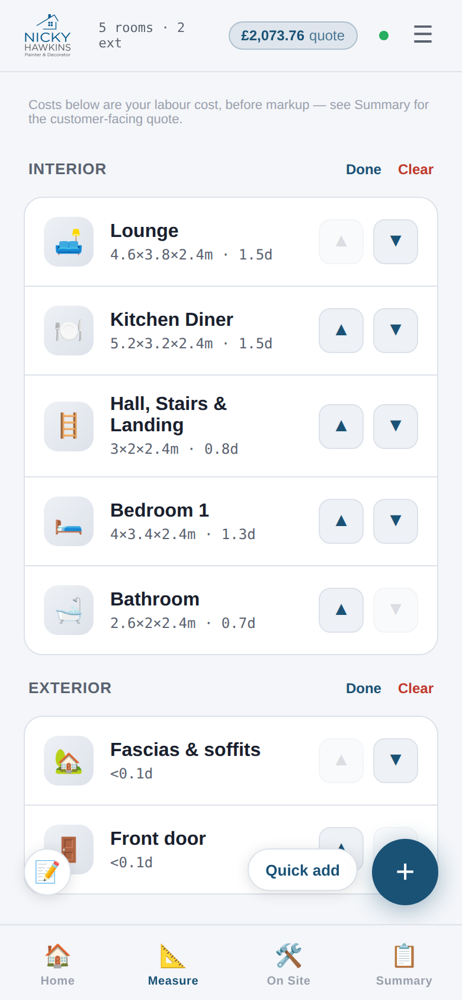

Tap it and every row swaps its cost for **▲▼** arrows; tap those to walk a row up or down. It's one mode for the whole screen — every section's link reads **Done** while it's on, and any of them turns it back off. A row only ever moves **within its own section** (a room never walks into the exterior list), and the sections themselves keep their order. While you're reordering, rows don't open when tapped and can't be swiped away, so nothing gets deleted or edited by a stray finger — and the arrow at the top of a list is greyed out because there's nothing above it.

**The order you set is the order everything downstream reads:** the Summary breakdown, the client-facing Quote view, the Xero quote, the CSV export and the final invoice. Each move saves as you make it, like any other change (offline included, queued until you're back in signal). Bulk edit and Reorder are one at a time — turning either on takes the other's link off the header until you're done.

### Adding a room


The form is in two halves, and it follows how you actually work: **walk the room** first — every card that asks you to look at something and count it — then **decide the scheme** once at the end, in the last three cards. Nothing makes you jump back and forth between measuring and pricing while you're stood there with a tape.

**Every card is collapsed when the form opens**, so what you see first is a short index of the room rather than a page to scroll past — tap a heading to open that card, tap it again to fold it away. The two exceptions are at the top: **Room Details** (the room name, the Staircase / HSL toggle, and — once the quote is accepted — the **Variation** toggle) is always on screen, since you touch them on every room, and **Dimensions** starts open because you fill it in every time. Dimensions is still an ordinary section, so once you've measured you can collapse it too and keep the rest of the form in view.

Only the top matters for a basic room:

1. **Room Name** — e.g. "Living Room".
2. **Dimensions** — pick the **Room shape** first:
   - **Standard** — length × width × height, for a plain rectangular room (the default).
   - **Perimeter** — type the wall perimeter and ceiling height directly, plus the ceiling area, when the footprint doesn't reduce to L×W.
   - **Segments** — build the room from rectangular zones (each L×W) that sum into the wall run and ceiling area — made for L-shapes and rooms with big alcoves.

   In any mode, the **Bay Window & Alcove/Dormer** add-ons cover the common awkward bits: bay window extra perimeter, alcove/dormer wall and ceiling area, and a sloped-ceiling toggle (type the measured ceiling area directly, since a slope makes length × width wrong). So loft rooms and bays no longer need fudged numbers. (The **Staircase / HSL** toggle above swaps this card for staircase geometry — see [Staircases](#staircases-hall-stairs--landing) below.)

   

#### Walk the room

The rest of the measuring cards follow in the order you'd meet them moving round the room — all optional, all collapsed until you tap them, and you skip whatever the room hasn't got:

- **Doors & Frames** — doors and their frames are priced as separate line items, each with its own quantity and coats:

  

  Leave a Door or Frame's quantity at 0 to price just the other one. Their prep comes from the room's **Preparation** card — there's one prep decision per room, not a separate one here. Per line you'll also find **Fire door** (an FD30/FD60 intumescent-compatible surcharge, edges included in the coverage calc), **ironmongery** (remove-and-refit, or mask-in-place — mutually exclusive), and **Both sides** (price the whole leaf as one line instead of just the face seen from this room — handy for a door between two painted rooms, split one face each). **Self-priming** for doors and frames is not here — it's with the rest of the woodwork's priming, under **Paint & Colour › Woodwork Primer** ([below](#decide-the-scheme)), and the row here just says so.
- **Extras** — windows (m²), window sills and radiators. Each adds its own time and paint. Putting a figure in **Radiators** also brings up the **Radiators** colour row in Paint & Colour below — see [Radiator colours](#radiator-colours).
- **Feature Wall** — one wall in a different finish: paint, or wallpaper (standard, wide vinyl or mural).
- **Wallpaper** — lining and finish paper for walls or ceiling, priced per roll with an automatic **rolls-to-order** count, plus a free-text note for the paper itself. Covered in detail in [Wallpaper](#wallpaper--rolls-to-order) below.
- **Excluded Walls** — walls you're *not* painting (a tiled wall, wallpaper that's staying). Add its width × height and it's deducted.
- **Panelling** — wall panelling by area with its own coats (up to 4), prep and colour, independent of the room's own settings. Leave a wall's **−m²** chip on when the panelling sits on the room's own walls: its area comes off the painted walls *and* the wallpapered walls, so you can paper a room and paint its panelling without paying for either twice. For half-height panelling enter just the panelled part — the wall above keeps its paint or paper.

  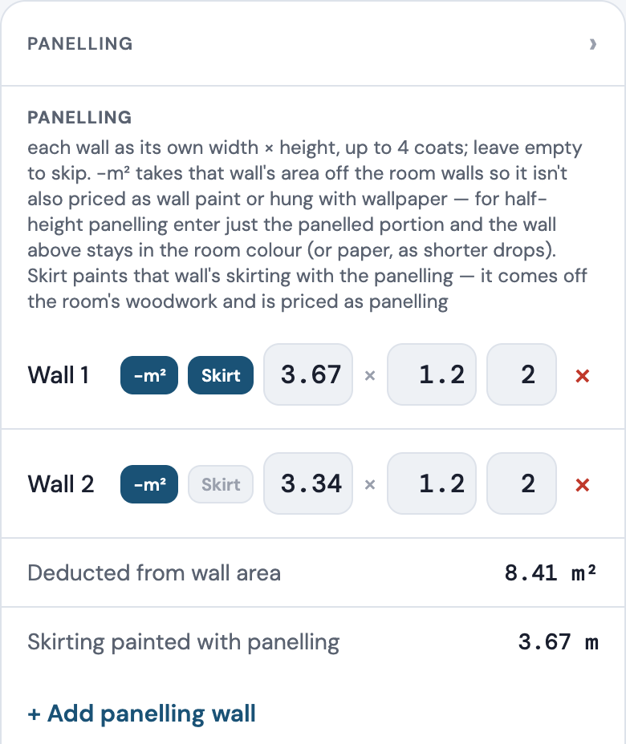

  The **Skirt** chip is for skirting painted in the panelling's paint and colour, which it usually is. With it on, that wall's skirting comes off the room's woodwork (both the time and the woodwork paint) and is priced as part of the panelling instead: the wall's width × a 0.15 m skirting board, at the panelling's coats, time rate and prep, out of the panelling tin. **Skirting painted with panelling** under the rows shows how many metres have moved, and on Summary the room's line reads **Panelling (incl. skirting)**. Both chips start on for a new wall; tap **Skirt** off where the skirting is a different colour and it stays with the rest of the woodwork. Rooms saved before this chip existed keep their skirting as woodwork until you tap it on. It works on staircase rooms too.
- **Mist Coat** — for fresh plaster; tick walls and/or ceiling, with a manual area override for "only part of it is new plaster".

#### Decide the scheme

Once you've stopped measuring, the last three cards are the pricing decisions — made once, with the room already captured:

- **Coats** — walls, ceiling and woodwork each default to 2. Set any of them to 0 to skip that surface entirely (e.g. ceiling not being painted). Below the coat counts sit three independent **spray toggles** — one per surface:

  

  **Spray walls** is off by default (also adds the spray sundries bump for the extra masking); **Spray ceiling** and **Spray woodwork** are on by default, since ceilings and woodwork are normally sprayed. A surface's toggle adds the Rates spraying uplift % to its litres on top of the standard or per-product rate — labour time is unchanged either way.
- **Preparation** — Minimal / Standard / Heavy, or a custom percentage. This scales labour across the whole room, doors and frames included. **Making Good** adds a fixed £ amount for repairs.
- **Paint & Colour** — each surface takes your default product from Settings; override the product or colour band here when a room is different. The **colour** itself is a free-text box per surface (walls, ceiling, woodwork, and again on Feature Wall and Panelling), pre-filled with where it goes — leave it as it is and decide later. See [Colours](#7-colours). A room with radiators measured also gets a **Radiators** colour row here — see [Radiator colours](#radiator-colours).

  **Self-priming lives on this card**, under **Woodwork Primer** — both toggles, together, rather than one in Doors & Frames and the other in Preparation:

  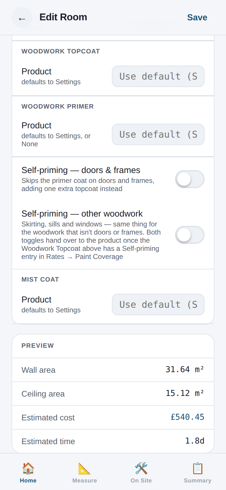

  **Self-priming — doors & frames** and **Self-priming — other woodwork** (skirting, sills, windows) each skip the primer coat on their woodwork and add one extra topcoat in its place. Sitting them under the primer product is the point: with a toggle on, that primer isn't bought for that woodwork. The **Woodwork Topcoat** product a couple of rows above can take the decision off you entirely — give that paint a Coverage Rates entry in Rates with **Self-priming** set, and both toggles are replaced by a note reading *On — ⟨product⟩*, because the product has decided. Clear the entry and your toggles come back exactly as you left them.

Two cards at the bottom sum up what you've entered:

- **Preview** — the live estimated cost and time, updating as you type.
- **Paint Needed** — how many litres this room takes, per surface, at your coverage rates (with each surface's spray uplift already included, rounded up to the half litre):

  

  These are the same figures Summary's materials list buys from — a feature wall in the room's own colour and product folds into the Walls line rather than getting its own row, since that's one tin of paint bought once.

### Staircases (Hall, Stairs & Landing)

Stairwells are the hardest thing to measure by hand — big raking walls you can't get a tape across, hall and landing running into each other. The app does the geometry for you. Flick the **Staircase / HSL** toggle at the top of the room form and the Dimensions card is replaced with staircase geometry:


Work down the cards:

1. **Number of Floors** — 1, 2 or 3 including the ground floor. A typical two-storey house is **2**: ground-floor hall, one staircase, first-floor landing. Choose 3 and a second staircase and landing appear.
2. **Ground Floor Hall** — plain length × width × height, like any room.
3. **Staircase 1** — this is where the app earns its keep:


- **Stair walls** — how many sides of the staircase get painted (1 or 2).
- **Steps** — count them as you go up.
- **Stair width** — the physical width of the stairs.
- **Wall height at bottom** — floor to ceiling at the foot of the stairs.
- **Riser** and **Tread** — pre-filled with the standard 220 mm; only touch these on an unusual staircase.
- **Top step** — the one measurement people get wrong, so it has its own diagram:


The trick, as the diagram shows, is that the big raking stair wall's width is **derived, never measured**: hall width + (steps × going) + top step. Measuring across the top instead double-counts the stairwell void; measuring along the bottom is impossible because the stairs are in the way. You measure only the easy things — heights straight up with a laser — and the app builds the wall from the step geometry.

4. **1st Floor Landing** (and 2nd, for three floors) — plain length × width × height again.
5. **Staircase Details** — spindles, newel posts and their woodwork coats. These are priced per piece, with their own timings editable under Rates → Time Rates.

The **Staircase Areas** card at the bottom shows its working — so you can see exactly what you're pricing and sanity-check it against the space you're standing in:


Here the derived stair wall width is 5.01 m (1.9 m hall + 13 steps × 0.22 m + 0.25 m top step), giving 13.23 m² of raking stair wall on top of the hall's 29.28 m² and the landing's 23.52 m² — a 66 m² job in total, priced at 2.74 days, without a tape measure going anywhere near the stairwell.

### Wallpaper & rolls to order

Any room (including a staircase) can have wallpaper on the walls, the ceiling, or both. Open the **Wallpaper** section of the room form:


- **Pattern / product note** — free text at the top of the card, for whatever you'll want to know later: the pattern name, the supplier, "paste-the-wall", "heavy vinyl, needs a seam roller". Write it while you're stood in the room looking at the paper, and it's there when you come to order or come back to the job. It's **your note, not the client's** — it never appears on the client quote, the Xero quote or the Colours screen, and it doesn't affect a single figure. Optional; leave it blank if the paper is unremarkable.
- **Lining / Finish** — tap either or both. Both on means "line out, then hang finish paper", and each is priced separately per roll (rates in Rates → Wallpaper Rates). The labour appears immediately.
- **Roll length / Roll width** — pre-filled with the standard 10.05 m × 0.53 m; check the label of the actual paper and adjust.
- **Pattern match** — *No match* (lining papers, plains), *Straight* or *Offset*. A pattern match wastes paper, and the calculation accounts for it.
- **Pattern repeat** — in cm, straight off the roll label.
- **Spare roll** — adds one extra to the order, just in case.

Below the inputs the app shows its working, batch-book style: the **drop length** (wall height plus trim allowance, lengthened to allow for the pattern repeat when there's a match), **drops per roll / drops needed**, and the bottom line — **Rolls to order**. Read that to the client off your phone.


Two things worth knowing:

- The rolls figure is a **buying guide, not a charge** — the labour feeds the quote; the client buys the paper — and the app deliberately doesn't supply it.
- On a staircase/HSL room, wallpaper labour automatically picks up the **staircase multiplier**. Ceilings get their own multiplier the same way.
- **Panelling comes off the paper.** Any Panelling wall with its **−m²** chip on is taken out of the wall paper: a full-height panelled wall loses its drops altogether, and half-height panelling (wainscoting) leaves shorter drops above it, which the count cuts from the offcuts left on your rolls. Turn the chip off for panelling that isn't on the papered walls (a bath panel, boxing-in). Staircase rooms don't do this yet — their paper is still worked out from the full stair walls.

Besides the standard roll calculation above, two other wallpaper types are available (feature wall only, under Rates → Wallpaper Rates for pricing): **Wide Vinyl** (commercial 137 cm material, priced per metre/area) and **Mural** (printed to the wall size, priced per m² or a flat fee).

### Adding an exterior item


Exterior work is priced per *item* — typically one per elevation ("Front elevation", "Rear + gable") or per job type ("Fascias all round"). Each item is a menu of exterior work; fill in only what applies:

- **Masonry / Render** — area in m² and coats, with toggles for **textured render** (more paint, more time) and **spray render**.
- **Fascias & Soffits** — linear metres and coats.
- **Exterior Windows** — one row per matching group, with panes-per-window and a size band.
- **Exterior Doors & Frames** — same fire-door/ironmongery/self-priming options as interior doors, split the same way.
- **Garage Doors**, **Porch / Feature Door** — priced in days.
- **Sash Window Restoration** — prime & paint plus resin repairs, reglazing, draught-proofing, cords and beads, added per window.
- **Preparation** and **Making Good** — same idea as rooms.
- **Paint Colours** — one masonry colour and one exterior woodwork colour per item, in the same free-text boxes the rooms use.

Access uplifts for 1st floor and 2nd floor+ work are applied per item automatically; the percentages live in Rates. Exterior paint litres are estimated from assumed areas per unit (window, sash, door, garage, fascia width) — calibrate these in **Rates → Exterior Paint Coverage & Areas** as real jobs prove them out.

### Site notes

Tap the **📝 button** (bottom left of Measure) any time to jot job notes — access arrangements, things agreed on the doorstep, snags you spotted. Notes save automatically and stay with the job.


---

## 4. Kitchen cabinet respray

On **Measure**, tap **`+` → Kitchen** to open the dedicated cabinet-spray calculator — one kitchen per job, saved automatically. Once it has anything in it, the kitchen appears as its own priced line in the Measure list and the quote.


- **Coat count** (1–4) applies to every item below.
- Tap open **Doors, Drawer Fronts, End Panels** and **Fillers** and enter how many of each size (Small / Medium / Large / X-Large). Each size has its own base price and per-coat price — tune them in Rates → Kitchen Rates. Each card shows its piece count on the header once collapsed, so you can shut them all and tally the kitchen at a glance.
- **Linear items** — cornices and plinths are priced per metre.
- **Carcass spraying** — toggle on to add a percentage uplift for spraying the cabinet interiors/carcasses.
- **Colour & Product** — pick the paint for the quote and materials list.

Two cards sit above the item counts and apply across everything below them:


- **Outside faces only** — for jobs where only the fronts are being sprayed. Turn it on and doors, drawer fronts, end panels and fillers are all priced at **half** — the per-piece prices in Rates are whole-piece, both-faces figures, so half is one face. Carcass spraying, cornices/plinths and stripping deliberately stay at full price (the carcasses are the same surface either way; trim has one face to begin with), and the client's quote line reads "outside faces only" so the scope limit is on their copy too. Off by default, so nothing you've already quoted changes.
- **Strip original coating** — for spraying over melamine. Adds stripping time to every piece counted, at your day rate, worked out from the counts already entered — the line beneath the toggle shows the sum it priced so you can check it before it lands in the total. Off by default and the minutes-per-size are editable under Rates → Kitchen Rates.

---

## 5. Fitted units

**+ → Fitted Unit** on Measure — for bespoke built-ins: a bookcase or media unit with open shelving above and cabinet doors below. You can add several to one job, each auto-named "Fitted Unit N" (rename it — "Left alcove", "Media wall unit" — so multiple units read apart on the quote, materials and client view).


Unlike the kitchen calculator's flat £ pricing, a fitted unit is priced in **minutes**, like rooms and doors, so it stacks properly into the day-rate maths:

- **Bays, Height per bay, Depth** — one shared height and depth for the whole unit (fitted units are near-always a consistent height); a width input appears per bay, so uneven layouts (a wide TV recess between narrower shelf bays) are no problem.
- **Shelves** — total across all bays, priced as a fixed spray time each (top, underside and front edge in one unit).
- **Cabinet doors** — priced at the interior door rate, **one face** by default (a built-in is normally painted from the front only). **Door size** scales this for cupboard-size (½) or wardrobe-size (1½×) doors, and **Both sides** prices the whole leaf — doubling that unit's door labour and litres — for units sprayed inside and out. Shelves and bay carcasses are unaffected by either.
- **Prep Level** — Bare/Primed (full prime + 2 coats) or Existing painted (light key-sand + topcoat, no primer bought).
- **Sprayed finish** — off by default; adds the Rates spraying uplift to the litres.
- **Complexity/Masking** — None / +10% / +20%, for recessed lighting, tight bays or electrics to mask off. Stacks on labour time before markup, same shape as the Commercial toggle.
- **Colour & Product** — defaults to your Settings woodwork topcoat.

The **Breakdown** card shows the priced result before markup, same as a room's Preview.

---

## 6. Custom line items

**+ → Custom line** on Measure — for one-off items that don't fit any pricing model: "Install panelling — £450", or "Extra sheet of ply — £40 × 2".


Type a **Description**, a **Unit price** (ex VAT) and an optional **Quantity** (default 1). The **Apply markup** toggle decides how it behaves on the quote: on (the default) joins the commercial/markup calculation like any other line; off, the price goes onto the quote *exactly* as entered — for ad-hoc prices that already have your margin baked in. Custom lines sit in their own section on Measure with a MANUAL tag so they never read as a calculation, are fully editable and swipe-deletable, and flow through to the Summary breakdown, the client-facing Quote view, the Xero quote and the final invoice. No sundries % is added to them either way.

---

## 7. Colours

**You never have to decide a colour to finish a measure.** Every painted surface starts out named after where it is — "Lounge Feature Wall", "Bedroom 1 Main Walls" — so a colour you haven't discussed yet still reads as something you recognise weeks later, instead of as "Colour 3". When the client makes their mind up, you type the real name over the top. Same box, same place, whenever it happens.

Each surface's colour is one free-text field, on the room form under **Paint & Colour** and again on this screen. Type into it and the built-in library of nearly 3,400 colours (Farrow & Ball, Little Greene, Dulux, Dulux Heritage, Paint & Paper Library, RAL Classic, Lick, COAT and Valspar) autocompletes as you go, filling in the brand and code the merchant needs. The search reads the **brand** as well as the name, so typing "lick", "coat" or "valspar" shows you what they do; for the brands whose colours are described rather than numbered it reads the description too, so "charcoal" brings up COAT's The Coal Drop and "anthracite" brings up RAL 7016. Eight matches show at a time, best first. Under each name you get the brand, plus its **No.** where the brand issues one (Farrow & Ball No. 28) or the shade in words where it doesn't (COAT · Charcoal Grey). **Valspar carries the name only** — B&Q tints to the colour's name at the counter, and Valspar's own chart codes come in four formats that don't agree with each other, so a code on the quote would be something nobody can order from. A colour that isn't in the library is fine as free text, and can be saved to the library for next time — including the same name under a second brand. Typing just a **brand** ("lick", "coat") is a way to browse what it does, so the field won't take a bare brand name as a colour — tap one of its colours from the list instead, or type a bit more.

Under the field are **quick-pick chips**: every other colour already on this job, one tap each. That's how a colour used in two places gets shared, so the job buys one tin between them rather than two. Typing the same name twice does the same thing — the second one joins the first rather than making a duplicate.

Menu (☰) → **Colours** is the job-wide view of all of it:


**Colours by area** lists every painted surface in the job, room by room, each with the same editable field and marked **Named** or **To decide** — so you can see at a glance what's still open and settle any of it from one screen. It's somewhere to look, not a step you have to complete.

Below that, **What to buy** is the ordering view, unchanged: each colour, the rooms and surfaces it covers, and **how much paint to order** — the same calculation Summary uses, so the two can never disagree. Look here, not at Summary, when you're actually buying paint.

> **Naming a shared colour only changes the one you're on.** If six surfaces are all on the same undecided colour and you name one of them, that surface gets a colour of its own and the other five stay as they were — the field says so underneath while it's shared. To put them all on it, tap its quick-pick chip on each, or just type the name again.

---

## 8. Price Lookup & Shopping List

Two small tools off the menu, independent of any one job.

**🔍 Price Lookup** searches every sales item in your Xero account by name or code and shows what it actually costs at the till — your **buy** price from Xero, inc VAT, with the ex-VAT figure underneath, which is the number printed on the supplier's price list. It is not your sell price: that has your markup on it, and belongs on quotes, not at the counter. An item with no buy price in Xero says **no buy price** rather than showing £0.00. It's a read-only till check, not tied to any quote:


Tap the **+** on a result to add it straight to your Shopping List.

**🛒 Shopping List** is a persistent, global pick-up list — not scoped to any one job, so a shop run can buy for whatever's on:


Items arrive from Price Lookup, or type one straight in ("masking tape") for anything that isn't a Xero item. They can also come off a job: tap **🛒 Add to list** on any materials row on **On Site**, or on a materials row on **Summary** — see [Putting materials on the shopping list](#putting-materials-on-the-shopping-list). Tick items off as you buy them and **Clear ticked** to reset for next time; items added from a job's materials carry that job's name as a tag, so the list says why something's on it.

---

## 9. The quote (Summary)

Open **📋 Summary** and the job becomes a priced quote:


The hero card shows the **total quote**, days on site, and the markup applied. Below it:

- **Labour** (before markup) and **On Site days** at a glance.
- **Imported from Xero (pre-app quote)** — a toggle for jobs originally agreed directly in Xero before this app existed. Turn it on to honour that agreed labour figure as-is instead of the app's own room calculation; materials still come from Measure as normal. It only applies to a handful of jobs, so it isn't shown on every one: it appears automatically on any job already using it and on any job brought in by **Import an accepted quote from Xero**. On an ordinary job you'll see a single line, **"Labour agreed in a pre-app Xero quote?"**, in its place — tap that and the toggle appears. Leave it off for anything measured and priced in the app.
- **Commercial job** — a toggle that adds a percentage uplift (default 10%) before markup, for commercial rather than domestic work.
- **Standalone job** — for a job booked on its own, where 1.6 calculated days still blocks out 2 diary days: this toggle charges labour at whole diary days × your day rate (rounding up to a full or half day, per the setting in Rates). It never discounts — if the calculated labour already beats the rounded figure, nothing changes. Both figures stay visible on the quote maths, and the top-up flows through markup, deposit, Xero and the final invoice like any other labour. A job can be commercial, standalone, both or neither.
- **Markup / Discount** — this quote can override your default markup; enter a negative number for a discount.

Scroll further for the full breakdown — every room, exterior item, kitchen, fitted unit and custom line priced, labour subtotal, sundries, markup — followed by the **Materials** list: each paint totalled in litres and converted into tins to buy.

Materials list **one line per product and tin size**, the way On Site has always shown them, with the surfaces that line's tins are for underneath it: *"Lounge Main Walls · 2 · Bedroom 1 Main Walls · 1"*. The same paint in two rooms is one line of three tins, not two lines you can't tell apart. Once every colour on a line has a real name, the name replaces the generic colour band inside the product itself — *"Tikkurila Optiva 5 – Colours 3ltr"* becomes *"Tikkurila Optiva 5 – Farrow & Ball No. 28 Dead Salmon 3ltr"* — on Summary, on the client's quote and in Xero, exactly as it already reads on an invoice. Until then the line keeps the generic wording and the surfaces underneath say what it's for. Editing a quantity on one of these rows takes the change off the **largest colour first**, and never leaves a colour holding no paint at all — a wall missing off the shopping list costs you a second trip, a spare tin doesn't. When the colour you wanted cut isn't the one it chose, **tap the surfaces line** under the product (it reads *▸ … · set each*) to open a **box per colour** and set them yourself; the row also opens itself straight after you type a total, so you can always see which colours it landed on. Type a total lower than the number of colours on the row and it holds at one each and says so, rather than deciding for you which wall goes unpainted — put **0** in a colour's own box to go below that. Deleting a row deletes that product, every colour of it.


### Materials & Undo

Materials are quoted as an estimate and — once the job runs — invoiced as used, so the list on Summary and On Site is the same list throughout a job's life. **Add Material** searches your Xero items (or free-text) for anything the calculation missed — an exterior plastic door, a kitchen, anything you've deleted the calculated line for and are entering by hand. Manually-added lines carry a **Chargeable** switch which is **on by default**, so what you add is on the quote, in the Materials subtotal and in the deposit like any other material. Turn it **off** to keep a line as tracking-only: it stays on your shopping list but is left out of the total, and the card then says how much is sitting there — *"Tracking only — not on the quote"* under the subtotal — so nothing is ever quietly missing off a price. A row you've already added shows **Chargeable** or **Tracking only** as a tag; tap the tag to switch it. **Recalculate** re-pulls the calculated lines from the rooms without throwing away your own additions: anything you added yourself is kept and tagged **"added by you"**, a quantity you've typed over is kept and tagged **"edited"** (with a **reset to N** link if you want the calculation's figure back), and if recalculating would drop something you edited by hand, you're asked first, by name.

Almost anything you do to the materials list — recalculating, deleting a line, changing a quantity, adding a line — can be undone. Look for an **UNDO** button on the confirmation message right after the change, **↩ Undo** at the top of the Materials list, or **↩ Undo** in the ☰ menu if you missed the moment. It remembers the last 10 changes on the current job; switching job or closing the app starts it fresh.

### Once a quote is accepted, its figures freeze

Everything in this app is calculated from your current Rates and Settings — right up until a client says yes. The moment a quote is **Accepted**, the app takes one snapshot of every figure — every room's price, the materials, the totals — and from then on the client-facing views read that frozen record, not a fresh recalculation. So nudging a coverage rate or a day rate next month can't silently move the price on a job someone already agreed to.

Because of that, an accepted job's Summary shows **one set of money**: the agreed one. The total at the top, then the **Accepted quote — Revision N** card underneath it with every line the client agreed, the materials, the deposit and balance **as agreed**, and the two things you can do to it — **Amend** and **History**.

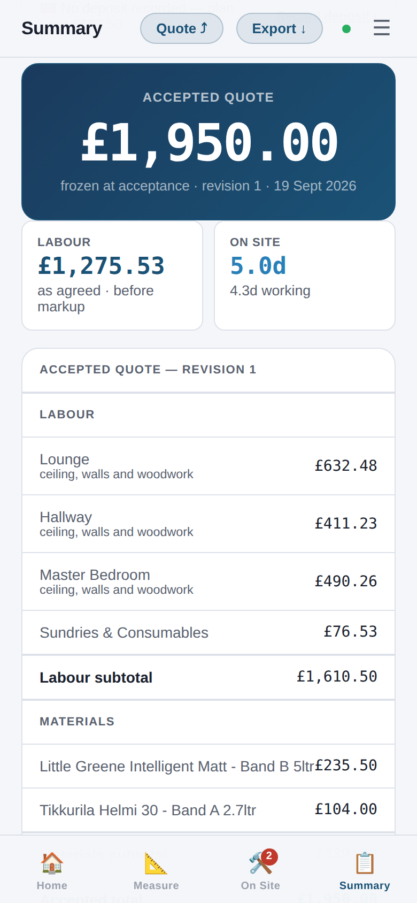

Below that card is the working side of the job: the **Room Breakdown** (where a room's days and per-surface detail live), the **Materials** shopping list, and the colours. Those are today's maths on the same job — you buy paint at today's prices — and a line above them says so.

**What's no longer there, and why.** Summary used to print today's price of the job beside the agreed one — *"Same job priced today: £X"* — with a rule across the screen marking where the agreed figures stopped, and the pricing controls greyed out with a strip explaining why. All of that has gone. Showing the live figure was how you *detected* a quote silently re-pricing itself, back before the snapshot existed to stop it happening; now that the agreed figures physically can't move, a second total on the same screen was just something to mistake for the first. Today's price is still worth seeing at the one moment it matters — when you're about to re-price the job — and that's where it now lives.

### Amending an accepted quote

If the job genuinely needs to change after acceptance, **Amend → revision N+1** on the accepted-quote card opens a sheet showing what the change would mean *before* you commit to it:

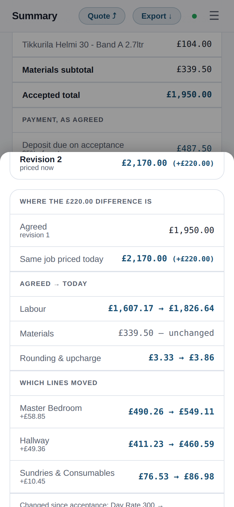

At the top: the revision you agreed, and the same job priced now, with the difference between them. Under it, **Where the £X difference is** — labour agreed → today, materials agreed → today, the £5 rounding on its own line, and then **which lines moved**, room by room, biggest mover first.

Underneath that it says whether the Rates page had anything to do with it. Only the settings that actually price a job are checked (the rates, the coverage table, the kitchen rates, the product choices), so exporting a backup or changing a payment plan never reads as a rate change. It also checks **the app's own version**: the rates are only half of what prices a job, and an update that changes how a room is costed will move the figure with nothing on the job touched. Where the build has changed since you accepted, it names both versions — so an unexplained few pounds has an explanation instead of looking like the app inventing money.

The **Commercial job**, **Standalone job** and **Markup / Discount** controls are in this sheet too, because this is the one place they still do anything on an accepted job: they price the revision you're about to write, and the two figures at the top move as you change them. (On a job still being quoted they're where they always were, on Summary.)

Last, a box to say **what changed**, which goes on the revision and is what History shows you later. Nothing is written until you tap **Amend**. The old revision stays on record; nothing is overwritten. Once there's more than one, **History (N revisions)** lists every revision with its date, its total and what each amendment added or took off.

If the amend would absorb extras you'd already flagged as variations, the sheet says so before you commit — see [extra work in a room you already measured](#extra-work-in-a-room-you-already-measured).

### Client-facing quote view

**Quote ⤴** (top bar, next to Export ↓) opens a branded, read-only one-page quote at customer-facing prices — room by room, colour schedule, payment terms and total, with your logo and business colours. It opens inside the app; tap **Save PDF** and it builds a real PDF file (as many pages as it needs) and hands it to your phone's share sheet — save it, email it straight to the client, or send it to a printer. It works with no signal, so you can produce a quote PDF standing in a house with no bars. It's regenerated live every time you open it, so it never shows stale figures, and doesn't touch Xero at all.

### Recording a deposit

Once the job is **Accepted**, the status card carries the deposit line — unless you've turned off **Deposit required** (its own toggle, default on, for jobs that don't want one: a client who always pays, work squeezed in around a bigger job).


1. **Record deposit ›** — the amount is pre-filled from the quote's deposit figure; correct it to what was really paid, set the date the money arrived (matching your bank feed), add a note if you like, **Save deposit**.
2. **Sync to Xero** — creates it in Xero as Receive Money → Received as Prepayment, against the bank account chosen in Settings. **Don't also enter it in Xero yourself** — doing both double-counts the money against your bank feed.
3. **Apply it to the invoice in Xero** when you raise the invoice, exactly as before — the app can't do this step, since Xero won't let a payment be applied to a still-draft invoice.

The line then shows where things stand — *not in Xero yet*, *in Xero · unallocated*, or *in Xero · allocated ✓* — read back from Xero, which stays the boss: void or delete the deposit there and the app notices and stops saying it's synced. A failed sync loses nothing — the deposit stays recorded, the line turns red with the reason, and **Try again** is safe. Fixing a mistake (a typo, a refund) is done in Xero, not here — the app never edits or deletes a deposit that's already landed.

### The quote description

Under the breakdown sits the **Quote description** — the wording that rides the
**first line item** on the Xero quote, and describes that line. It's written for you from the job: the app picks the wording template
that fits the work (Painting, Wallpapering, Kitchen Cabinet Spraying and so on —
all editable in **Settings → Quote & Invoice Text**), fills in your products and
coats, and puts it in future tense for a quote and past tense for the final
invoice.

A job with **both rooms and exterior items** gets the **Interior & Exterior**
template, which has an INSIDE half and an OUTSIDE half — so a client reads the
promise about their furniture and flooring *and* the one about their windows,
doors and landscaping, instead of only the indoor one.

**It says what you actually measured.** Quote only the walls and it won't promise
ceilings and woodwork. Measure a feature wall, panelling, radiators, window sills
or a mist coat on new plaster and each one gets named — with its own product if
you gave it one:

> *Ceilings finished in Tikkurila Anti Reflex 2, walls in Tikkurila Optiva 5, the
> feature wall in Farrow & Ball Estate Emulsion, and all woodwork including
> skirtings, window sills and radiators in Tikkurila Helmi 30, each applied in 2
> coats. Newly plastered walls will be mist coated prior to finishing.*

A papered feature wall isn't listed as painted — it moves to the wallpapering
line instead, which names what's being papered.

**It never states a paint the job doesn't use.** It's a whole-job sentence, so
woodwork measured in one room puts woodwork in the wording for the job — and
where the rooms use *different* paints on the same surface, every one of them is
named rather than whichever room came first:

> *Ceilings finished in Tikkurila Anti Reflex 2, walls in Tikkurila Optiva 5 and
> Dulux Diamond Matt, and all woodwork including skirtings in Tikkurila Helmi 30,
> each applied in 2 coats.*

Only rooms that actually paint a surface get a say — an old product left on a
room with no wall coats doesn't count as a second paint — and a surface no room
paints at all keeps your Settings default. Coats work differently, because
there's nothing to list: where the surfaces disagree, no coat figure is stated
rather than a wrong one. Type the detail into the box yourself whenever you'd
rather spell out which room gets which.

**It describes one line, and every other line says what *it* is having.** Each
Xero line carries its own price, so the block opens *"Painting of Lounge:"* and
describes the Lounge — not a list of every room in the job on a line priced for
one of them. The protection and completion paragraphs are true of every room, so
they appear once and the later lines just point back at them. Here are the Xero
line descriptions the app writes, one after the other:

```
Painting of Lounge:
[protection · the Lounge's scope · completion]

Kitchen - same as above

Bedroom 1 - same as above

Bathroom
Ceilings finished in Tikkurila Anti Reflex 2 and walls in
Tikkurila Optiva 5, each applied in 2 coats.
Preparation and completion as above.

W.C.
Walls in Tikkurila Optiva 5, applied in 2 coats.
Preparation and completion as above.
```

**The first line isn't labelled twice.** The block already opens by naming the
room it sits on, so the room name is no longer put above it as well — that line
used to read *"Lounge"*, then *"Painting of Lounge:"* one line below it. The
label is still added wherever the block *doesn't* name the line: your own edited
wording that never mentions the room, an exterior template with a fixed heading,
or a line the block has moved onto because you dropped the room it was written
for.

**"Same as above" now means exactly that** — same as the first line. A room
matching it collapses, so identical bedrooms stay tidy and the detail appears
only where a room genuinely differs. Your own client quote view gets the short
version under each room name: *"ceiling, walls and woodwork"*, *"walls"*.

The box is editable: type in it and your version sticks from then on (**↺ Reset
to template** goes back). **Editing it also turns the per-room lines off** — once
the wording is yours, the app stops adding sentences underneath it that you
didn't write and can't edit; every other line goes back to "same as above".
Sending stamps the exact wording onto the quote, so a document you've already
sent never changes underneath you. Sending doesn't count as editing, though —
**Update quote in Xero** keeps each room's own lines exactly as the first send
wrote them.

**Exterior items get the same treatment**, from what you measured on them —
render (textured or not), fascias and soffits, windows, sash windows, doors,
garage doors, a porch — with repairs and restoration noted where you've logged
any. Each exterior line compares against the other *exterior* lines, so it only
carries text where it genuinely differs from them.

**Fitted units** describe themselves too — *"Fitted units including 3 bays, 9
shelves and 4 doors painted both sides in Tikkurila Helmi 30, applied in 2
coats. Bare surfaces will be primed first."* — with the product coming from the
unit's own picker (or your Settings woodwork topcoat) and the priming note
following each unit's **Bare / Already painted** setting. The **kitchen** fills
in its coat count; its product and colour aren't tracked in the app, so those
stay as `[product]` and `[colour/finish]` markers for you to type over, along
with the fitted units' `[spray/brush]` and the wallpaper templates'
`[paper name/supplier]`.

On the Xero quote, the kitchen and fitted-unit *lines* still read "same as
above" under the block — only rooms and exterior items get a per-line scope
sentence.

> **If you've edited your templates in Settings**, your saved copies keep whatever
> wording you gave them. To pick this up, put **`{surfaces}`** where the scope
> sentence should go (and **`{papered}`** where a wallpapering line names what's
> being papered) — or use **Reset to defaults** to take the supplied templates
> back.

### Sending to Xero

Expand the **client panel** at the top of Summary:

1. **Client name** — start typing and existing Xero contacts autocomplete; picking one fills phone, email and address into blank fields only (anything you've already typed wins). **Sync to Xero** pushes the app's details the other way.
2. **Street address** autocompletes as you type; picking a suggestion fills street, town and postcode.
3. Add a **Reference** if you use them.
4. Tap **Send to Xero**. The quote is created in Xero, ready to send to the client from there, and the job's status becomes **Quoted**.

If you edit the job afterwards, the button becomes **"Update quote Q-nnn in Xero"** so re-sending updates the *same* quote — with a "Send as a NEW quote instead" option when you genuinely want a second version. Answers given in Xero flow back into the app when you next open it; an answer given in the app always wins.

### When the client answers

- **Mark Accepted** — the job moves to Accepted (synced to Xero), its figures freeze (see above), and scheduling and On Site tracking unlock.
- **Mark Declined** — the job files itself away under Declined.

Quotes that sit unanswered longer than your "chase quotes after" setting (default 14 days) pop up on Home so nothing slips.

---

## 10. Jobs

Menu (☰) → **Jobs**. The app holds any number of jobs; the one you're working on is marked **CURRENT**, and everything on Measure, Kitchen, Summary and On Site belongs to it. Tap another job to switch. Rates and Settings are global — they apply to every job.


- **The client's name is the top line** of each row, with the job name and its status underneath — job names repeat ("Bedrooms" three times over), people don't. A job with no client saved shows its name on top instead; the client comes from the **Client** details on Summary's Xero panel.
- **Search** (top of the screen) filters every group as you type: client name, job name, calendar title, or a Xero quote/invoice number off a piece of paper. Several words all have to match, but not in the same field — "priya bedrooms" finds it. A count and a **Clear** link sit under the box, and the search resets each time you open the screen.

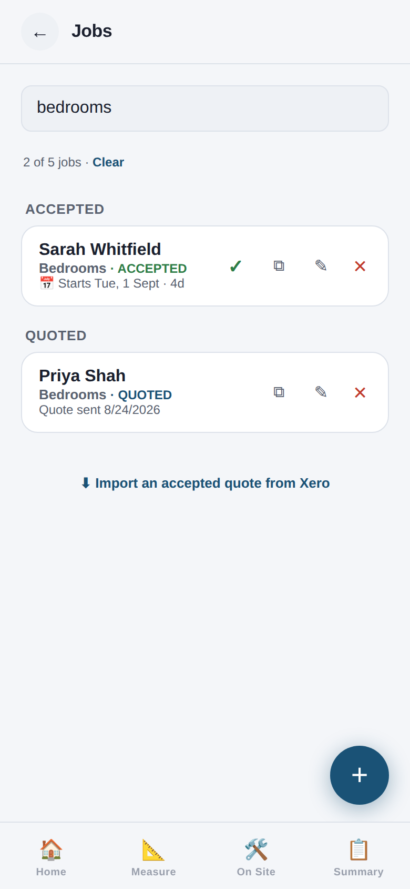

- Jobs group by status: **Draft → Quoted → Accepted / Declined → Completed → Invoiced**.
- **`+`** starts a new job. **✎** renames one. **⧉** duplicates a job as a quick template (notes aren't copied). Each job is fully separate — its own rooms, kitchen, colours and materials.
- **Import an accepted quote from Xero** — took the job on before the app existed? Import the Xero quote and it becomes a job here, with the agreed price as the record (adjustable via the **Agreed figures** card, or the **Imported from Xero** toggle on Summary — see [The quote](#9-the-quote-summary)). If a listed quote actually belongs to a job already in the app, use **"Already a job in the app? Link it ›"** instead of importing a duplicate.

---

## 11. Schedule

Menu (☰) → **Schedule** — or tap **Schedule ›** on an accepted job's Summary, which offers the next free slot automatically.


- Switch between **List**, **Weeks** and **Month** views. Jobs appear as coloured bars across their booked days; UK bank holidays are marked, and weekends are greyed out unless you've turned on **Work Saturdays** in Rates → Scheduling.
- **Tap a job's bar** → Open job, **Move start date** (then tap the new day), or Unschedule.
- **Tap an empty day** → start a job there, or **block days** for holidays and time off.
- The header tells you your **next free day** at all times.
- **What a job is called on the calendar:** entries read **client — job name — calendar title**, skipping anything the others already say. So a Kitchen job for Lauren Lowe reads "Lauren Lowe — Kitchen" whether or not you typed a calendar title, and an older job still named "Lauren Lowe - Kitchen" doesn't say her name twice. The client comes from the job's **Client** details (Xero panel on Summary) — if a job has no client saved, the entry is just the job name.

### Blocking days off

Holidays, a day at the dentist, a week's decorating on your own house — tap the
day and the sheet opens with the day's own actions first:

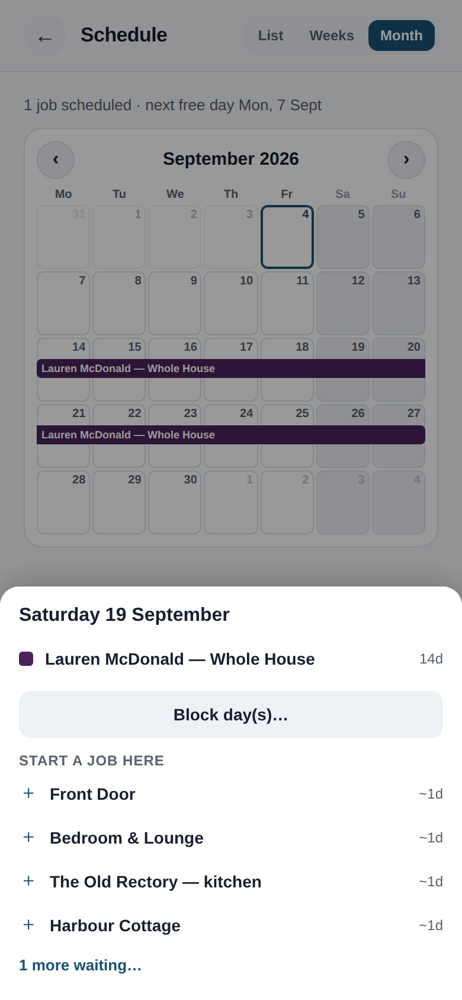

- **Block day(s)…** is offered on **every day from today onwards** — including
  Saturdays, Sundays and bank holidays. Your usual week may have those off,
  but a job set to *+ Saturdays* or *Every day* works them, and a block is the
  one thing that override never beats. The picture above is exactly that: a
  Saturday in the middle of a whole-house job.
- It takes a range: the day you tapped → an end date (the same day, for a
  single day off), plus an optional label such as *Holiday*. The day you
  tapped is always blocked. Days merely swept up in between are blocked only
  if you'd have been working them anyway — a weekend in the middle of a
  fortnight off is already off, so it isn't cluttered with a chip, unless a
  job was booked across it.
- Blocked days draw as a dashed grey bar across the calendar, are never
  offered as a start date, and booked jobs stretch **around** them. Your phone
  calendar feed agrees, so a blocked fortnight is a gap there too.
- Tap a blocked day for **Unblock this day**, or **Unblock all N days** to
  clear the whole run in one go.
- **Start a job here** lists the accepted jobs still waiting for a date, four
  at a time — tap **N more waiting…** for the rest. Blocking stays at the top
  of the sheet however many are waiting.

**A one-off day out of the ordinary**, without changing anything globally: tap the day itself → **start a job here** (or move a job there), and the confirm tells you what switches on — a Saturday turns on "Saturdays for this job only", a Sunday or bank holiday turns on "Every day for this job only". From an accepted job's own **Schedule ›** form, the same idea is the **Days worked** picker (Usual / + Saturdays / Every day), which switches itself if you pick such a start date. Automatic slot suggestions still only ever offer your usual working days, and your own blocked days always win.

**See jobs in your phone calendar:** Rates → Scheduling → turn on **Calendar feed**, then tap the link to copy it and subscribe in your calendar app. Booked jobs then appear alongside everything else in your life.

---

## 12. On Site — running the job

Once a job is accepted, the **🛠 On Site** tab is your day-to-day companion:


- **Estimated vs Actual** — the card at the top tracks what the materials are really costing against what you quoted, with the variance.
- **Time on Site** — tap **+ Log today (full day)** at the end of each day (or *Log a different day* to back-fill). This builds the true labour record for the job.
- **Materials** — the quote's materials list becomes a shopping list. Tick items off as you buy them, and correct quantities/prices to what you actually paid — see [Materials & Undo](#materials--undo) for how edits and Recalculate interact, and Undo if something goes wrong. Any row here can also go on your **Shopping List** — see below.
- **Add material the estimate missed** — extra sundries or a forgotten tin: search the product, set the price, done.
- **Variations** — the client asks for "just one more room" mid-job? Add the room (or exterior item, fitted unit) on Measure and flick its **Variation** toggle, in the **Room Details** card at the top of the form, with the room's name (it only appears once the quote has been accepted, and on a new room added after that it starts **on** — turn it off if the room is a correction to the original quote rather than extra work):

  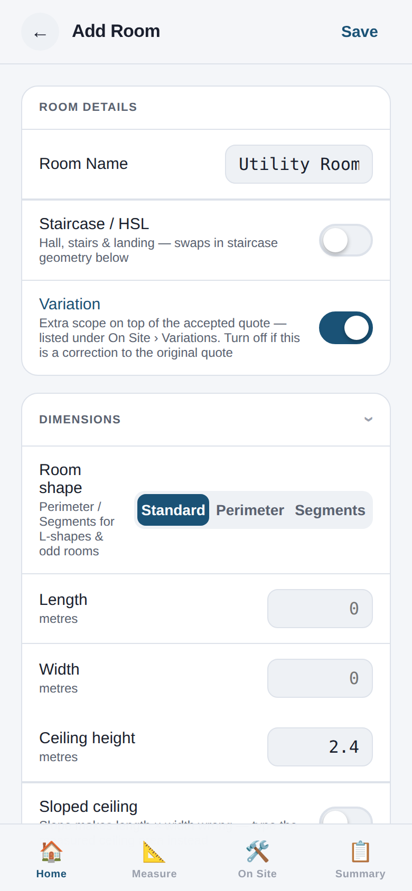

  It's priced with the same engine but kept separate from the accepted quote, and appears in its own Variations card here. Each variation carries a status — tap **✓ Approved by client** to record their yes (with an optional note; the date is stamped automatically), or mark one Declined to drop it from the totals and the final invoice while keeping the record. Anything still Pending gets called out before the final invoice will let it through. For extra work added *inside* a room you already measured, see [below](#extra-work-in-a-room-you-already-measured).
- **Spec sheet** — what's being done in every area, what colour each thing is going, and how far through it is. Tick Prep and Painted off as you go. See below.
- **Snags** — the punch list for the job, above everything else once there's something on it. See below.
- **Invoice ›** (top right) shows the materials list formatted for invoicing, with a **Copy** button.

#### Putting materials on the shopping list

This is the screen you have open standing in the room, so it's the one that answers *"do I still need to buy this?"* — and every materials row carries a **🛒 Add to list** chip, the quoted tins as well as the sundries you added yourself. Tap it and the product goes on your [Shopping List](#8-price-lookup--shopping-list) with its price and this job's name, and the chip changes to **✓ On list**:

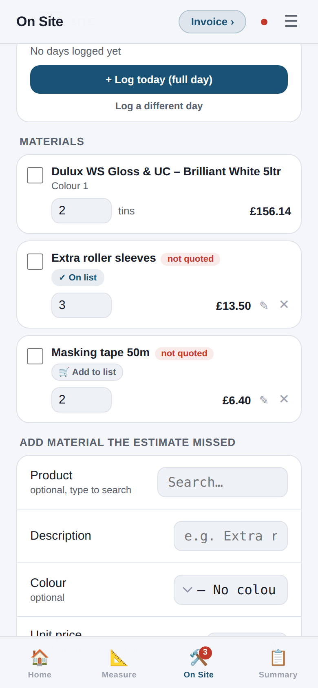

It's per row and never automatic — plenty of what's on a job is already in the van. Summary's materials list has the same chip on the quoted lines, and either route lands on the same list: one line per product, no duplicates however many times you tap, and both job names on it if two jobs need the same thing. Paint sold by the litre goes on **without a price**, because the figure on the row is a price per litre, not what a tin costs at the till. Ticked something off in the shop and then ran out? Tap the chip again and it goes back on the list.

### The spec sheet — what's going where, and how far through

On site the questions are small and constant: *which walls am I painting in
here*, *what colour is the radiator going*, *what have I still not touched*.
All of it was already in the app — just spread across the room screen, the
Colours tab and the materials list, which are screens for putting numbers in,
not for looking things up with a brush in your hand.

The **Spec sheet** puts the answers on one screen, and lets you tick them off.
It sits on On Site next to Snags, headed with how much is still outstanding:

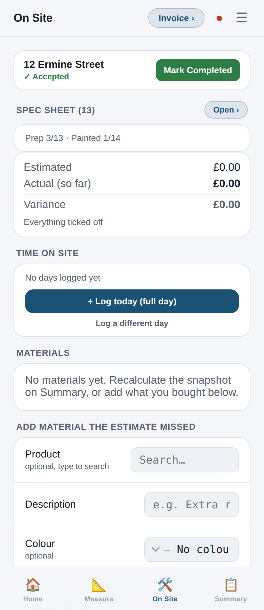

Tap **Open** and you get the whole job, area by area:

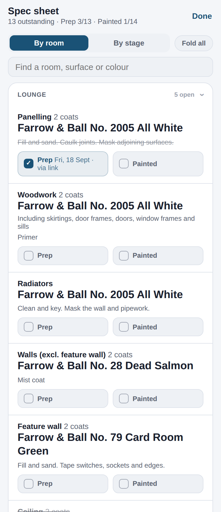

Every row is one surface in one area, in the order you'd actually work a room
— **ceiling, panelling, woodwork** (with what it includes, and **radiators**
right under it), **walls**, and the **feature wall last**. The colour is the
biggest thing on the row, because it's the thing you came to look up. Under it
sits the product and the prep, and under that the two boxes.

**It's built from the job, not typed twice.** The rows come from your rooms,
exterior items, kitchen, fitted units and custom lines every time you open it,
so they can't drift from what you've actually measured. Rename a colour on the
Colours tab and the sheet says the new name straight away. A surface with no
coats on it simply isn't there. Nothing on this screen can be edited except the
ticks — colours, coats and prep are changed where they live, so there's only
ever one place to change them.

**No prices anywhere on it** — not on the screen, not in the PDF, not on the
shared link. It's a working document, not a quote.

#### Ticking it off

Two boxes per row: **Prep**, then **Painted**. They're independent — tick
Painted without Prep if the prep was done last week or there wasn't any, or
tick Prep on its own. Each one keeps the date you ticked it.

- **Prep** strikes through the prep line. The row is still open — half done is
  not done.
- **Painted** clears the row: struck through, dimmed, and dropped to the bottom
  of its area. It stays on the list, because at the end of the job the list
  *is* the record of what got done. Untick anything and it goes straight back
  where it was.

Cleared rows sink to the bottom of their area and cleared areas sink to the
bottom of the sheet, exactly like snags — so three weeks in, what's left is at
the top. One thing worth knowing: that beats the working order, so a feature
wall you haven't touched sits *above* a ceiling you've finished. It's last in
the room's sequence, not last on the screen.

**Papered surfaces and custom lines get one box, Done** — there's no separate
prep step to a roll of wallpaper or to a line you typed in yourself.

#### By room, by stage, and finding things

**By stage** flattens the whole house: every ceiling in the job together, then
all the panelling, then the woodwork, and so on, with the room name on every
row. Use it to do one thing everywhere in one pass. Kitchen, fitted units,
exterior items and custom lines stay as their own blocks at the end — there's
nothing to batch between a kitchen and a garage door.

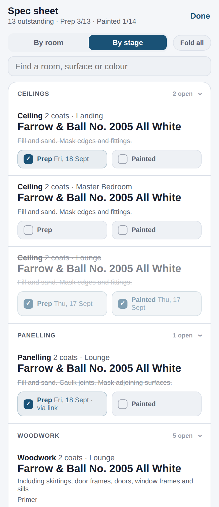

**Every heading folds**, same as the snag list: tap it and its rows fold away,
leaving the name and the count. An area you've finished with is folded to start
with, so a big house opens as the rooms that still have work in them — unless
*everything* is done, in which case it all opens, because you only opened it to
read the record. **Fold all** does the lot and turns into **Open all**.

**The find box** matches the surface, the colour, the room and the product, and
works in both views:

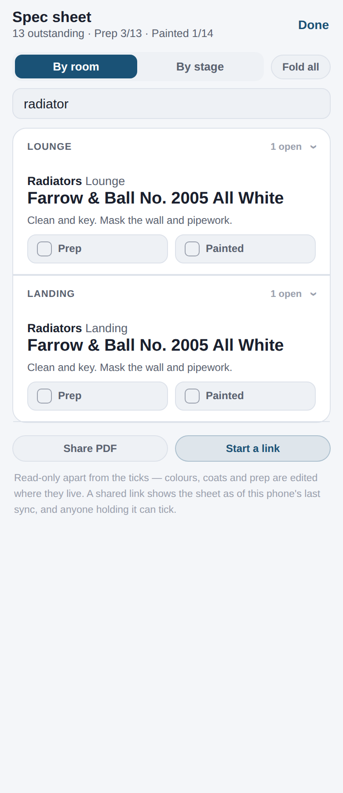

Type *radiator* and you get every room's radiator row with its colour. Type a
colour name and you get everywhere that colour is used. Clear it and the whole
sheet comes back.

#### The prep lines

Each row carries a prep line. Where the job records prep for that surface, that
wins — **Mist coat** with its product on new plaster, **Primer** with its
product where the room actually buys one, the fitted unit's prep level, the
kitchen's **Strip original coating**. Everything else gets the built-in line
for that surface ("*Fill and sand. Tape switches, sockets and edges.*"). The
Prep box belongs to whichever line is showing.

#### Variations on the sheet

Extras show up with everything else, tagged. An approved one reads **Variation
✓**; one still waiting reads **Variation, awaiting approval** — shown on
purpose, and tagged so it can't be read as a go-ahead. You *can* tick it; the
tag is the warning. A declined variation isn't on the sheet at all.

**Extra work added inside a room you already measured** is different, because
the app knows the room has grown but not *which* surface grew — so there's
nothing to tag, and putting "Variation" on all five of that room's rows would
say something untrue about four of them. The room's heading says it instead:
*Landing — includes extra work, awaiting approval*, or *✓* once it's approved,
or **includes extra work the client declined**. That last one is the one to
read: the work is still typed into the room, so it's still on the sheet with a
box beside it, and this is the only thing on the screen telling you not to
paint it. (See [Extra work in a room you already
measured](#extra-work-in-a-room-you-already-measured).) The heading carries it
in **By room**, and on the kitchen, unit and exterior blocks in By stage — a
By stage section covering ceilings across the whole house belongs to no one
room, so it doesn't claim to.

#### Sharing it: PDF

**Share PDF** at the foot of the sheet builds a one-file copy and hands it to
your phone's share sheet (on a computer it downloads). It's named for the job
and the day you exported it — *NH-Spec-12-Ermine-Street-2026-09-19.pdf* — and
stamped **Correct as of** the date and time, because a spec sheet moves.

It prints **the view you're looking at, in the order you're looking at it**, so
you can check the file against the screen: your business band at the top, the
job and the address, then how many are outstanding and how many done, then each
area with two boxes per row — empty for what's left, filled and dated for
what's done. It builds from what's on your phone, so a row you ticked in a
cellar with no bars is already ticked in the file. The client's name, phone and
email are not on it.

#### Sharing it: a live link anyone can tick

**Share link** creates a private web page for this job and hands you the URL.
Whoever you send it to opens it on their phone — no login, no app — and sees
the same sheet, with the same By room / By stage toggle, the same find box and
the same two boxes per row. **They can tick things off**, and their ticks show
up on your phone within about half a minute. Yours show up on their page the
same way.

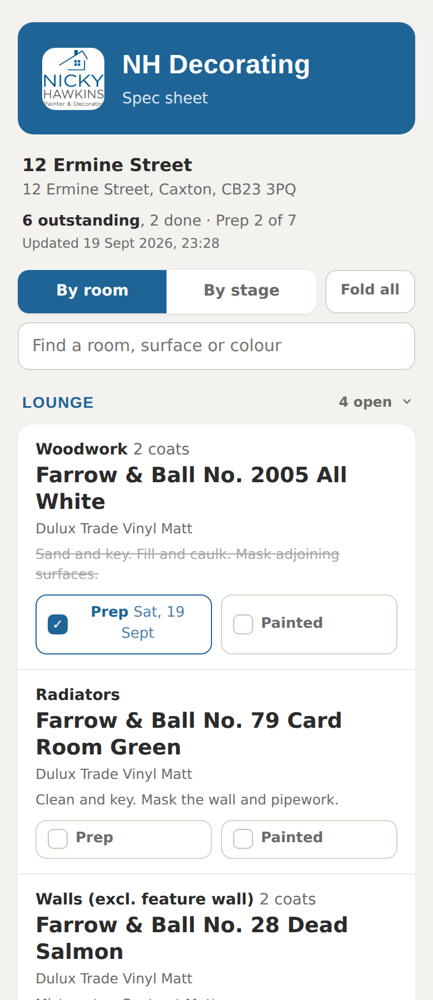

- **It's a different link from the client approval one.** That page has Approve
  and Decline buttons on it; this one doesn't, and handing a helper the wrong
  link would hand them those buttons. Either can be stopped without touching
  the other.
- **The rows are as of your phone's last sync.** The page says **Updated** and
  when. Edit a room, change a colour, and the page catches up within a couple
  of seconds if you've got signal — and when you haven't, it keeps showing the
  last version and its timestamp says how old that is.
- **The ticks are live either way.** They're not part of what gets published,
  so a tick never waits for a sync and never triggers one.
- **You can see which ticks came from the link.** Any step ticked from the page
  is marked *via link* on your phone, and you can untick anything.
- **Anyone with the link can tick.** That's the point of it, and it's worth
  knowing: forward it on and whoever holds it can tick rows. There are no
  prices and no client contact details on it, so what's exposed is progress.
  **Stop sharing** kills the link for everyone — and **leaves every tick where
  it is**, because the work happened whether or not anybody's still allowed to
  look at the page.

#### Radiator colours

Radiators normally go out in the woodwork colour, and that's what the sheet
shows. When a room wants something else, the room screen has a **Radiators**
row under the colours on the **Paint & Colour** card — **Same as woodwork** is
on by default, and switching it off gives you the ordinary colour field:

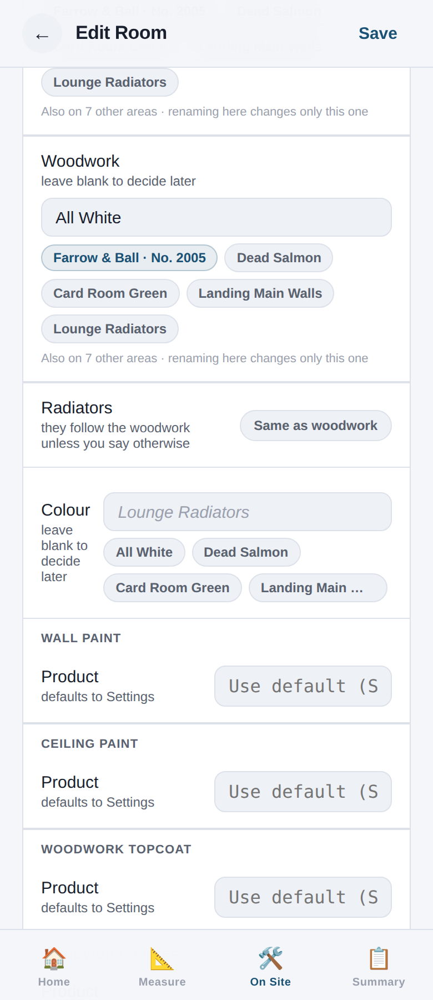

The row appears **once the room has radiators measured** — put the figure in
**Extras › Radiators** and it's there; a room with no radiators doesn't carry a
radiator colour to decide.

The field works exactly like every other colour field: type and your library
offers matches with brand and number, the colours already on this job are one
tap each underneath, and leaving it blank means *not decided yet* — which is a
different thing from *same as the woodwork*, so the chip and the blank field
don't mean the same. Set one and it shows on the spec sheet, on the Colours tab
as an area in its own right, and on the client's colour schedule
(*Woodwork/Radiators: Wimborne White* where they match, on their own line where
they don't). **It never changes what you buy** — radiators are priced as labour
and use no paint of their own, so a colour that's only on a radiator never
turns up as a tin on the list.

#### The spec sheet and signal

Same as everything else on On Site: tick things off in a house with no bars and
every tick queues on the phone and goes up when you're back in signal. The
sheet opens offline, the PDF generates offline with your queued ticks in it,
and a tick that hasn't synced yet is never overwritten by what the server still
thinks.

### Snags — the punch list

The last few days of a job are a list of small things: a scuff by the switch, a handle to refit, a staircase that wants one more coat. That list goes here, and On Site puts it above everything else while anything on it is still open.

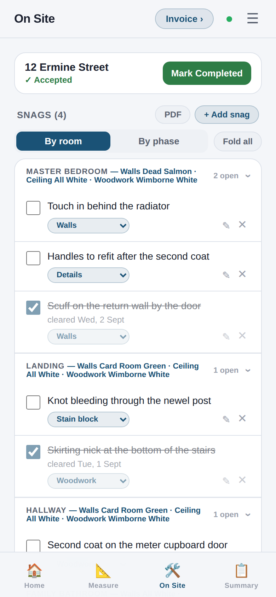

- **The section only shows up when there's something to show.** No snags yet, and there's just a quiet **+ Start a snag list** at the bottom of the screen. Tick the last one off and it drops back down there too, collapsed to **All n cleared ✓** — tap it to reopen the record.
- **Grouped by room**, with that room's colours next to its name, read straight from the Colours tab — each surface named where they differ (*Walls Dead Salmon · Ceiling All White*), or just the colour where the whole room is one. So you don't have to leave the screen to find out what to open. Rooms the quote never priced — the airing cupboard, the garage step — can have snags too, and you can give those a colour by hand (see below).
- **Ticking one off doesn't remove it — it drops to the bottom.** The row goes struck through with the date you cleared it and stays on the list, which is the point: at the end of the job the list *is* the evidence of what got done. But it moves below everything still open in that room, so three weeks in, with thirty things ticked off, the handful you've still got to do are the ones at the top rather than scattered through them. A room where everything's cleared drops below the rooms that still have work in them, and the same rule applies in the **By phase** view. Untick anything you tick by mistake and it goes straight back up where it was.
- **Phase** on each row (the little dropdown) is the pass it belongs to — Prep, Stain block, Woodwork, Walls, Ceiling, Details, Final access. Set it and the room re-sorts itself into working order, with anything that blocks the space once it's done (floor cleans, stair recoats) last. Snags with no phase yet sit at the top of their room so they're not forgotten.
- **By room / By phase.** The toggle flattens the whole house into phase order instead — every stain-block job in the building together, so you get the stain block out once. Room order is what it opens on.
- **Every group folds.** Tap a room heading (or a phase heading in the other view) and its snags fold away, leaving the heading, its colours and its count — *2 open*, or *all done ✓*. Tap it again to open it back up. A room you've finished with is folded to start with, so a forty-snag house opens as the rooms that still have work in them. Once you've tapped a heading yourself your choice sticks for the rest of the visit — the app won't fold a room back up under you when you tick its last snag off. **Fold all** (beside the toggle) folds the lot in one go and turns into **Open all**. Folding rooms doesn't touch the **By phase** view, or the other way round, and none of it is remembered between visits.
- **PDF** (next to **+ Add snag**) saves the list as it stands right now — see below.

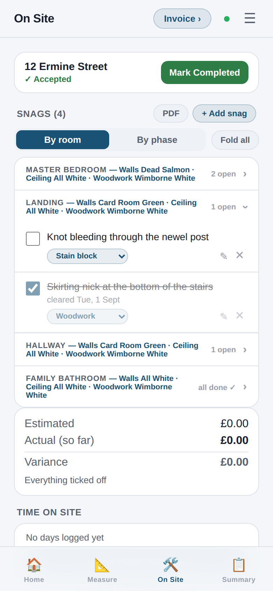

#### The snag list as a PDF

**PDF** at the top of the Snags section builds a one-file copy of the list and
hands it to your phone's share sheet, so it can go straight to the client, to
whoever's working with you, or into an email as a record. On a computer it
downloads instead. It's named for the job and the day you exported it
(*NH-Snags-12-Ermine-Street-2026-09-04.pdf*), because a snag list moves —
two exports a week apart *should* be two different files.

What's in it: your business name and logo at the top, the job, the client and
the address, then **how many are outstanding and how many are cleared**, then
the list room by room in the same order the screen is showing it — colours
beside each room name, the phase against each snag, an empty box for anything
still to do and a filled one, struck through and dated, for anything cleared.

It builds from what's on your phone, not from what's reached the server, so a
snag you ticked in a cellar with no bars is already ticked in the file. It
works with no signal at all. Once everything's cleared, **Export PDF** sits
under the reopened list at the bottom of the screen — that copy is the
completed punch list, which is the one worth sending on.

#### Adding snags

**+ Add snag** opens a sheet with two ways in.

**One snag** — pick the room (or **Custom…** and type a name), type the snag, set the phase if you know it. The sheet stays open on the same room afterwards, because snags come in runs.

**Paste a list** — for the list the client emails you, or the notes off your own phone. Paste it as it came: a line on its own is a room, and lines starting `-`, `*` or `1.` are the snags under it. `- [ ]` and `- [x]` checkboxes are fine — **both come in as still to do**, because on someone else's list a tick means "I've flagged this", not "you've fixed it".

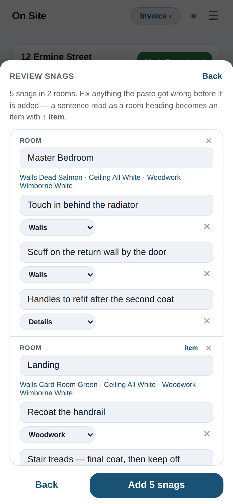

Nothing is written until you've looked at it. The review sheet shows exactly what it made of the paste, and everything on it is editable: room names, the snags themselves, and the phase on each one (pasted snags start with none — the app never guesses a phase from the wording, because it would guess wrong). If a stray sentence got read as a room heading, **↑ item** folds it back into the room above; **✕** drops a line. Then **Add n snags**.

#### Colours on rooms you never measured

On a job that came in from Xero there are no measured rooms at all, so there's
nothing for the snag headings to read a colour from. Any room heading with no
measured room behind it gets a **+ colour** tap instead:

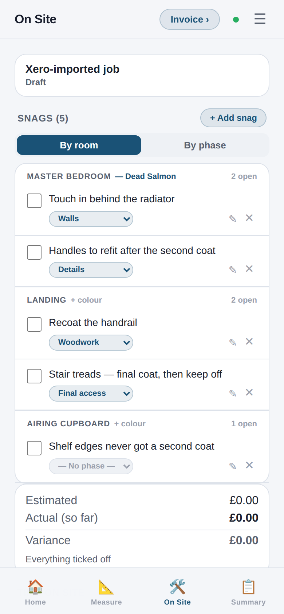

Tap it and you get the same colour field as everywhere else in the app: start
typing and your colour library offers matches with their brand and number, so
"dead sal" finds Farrow & Ball No. 28 Dead Salmon and fills the rest in for you.

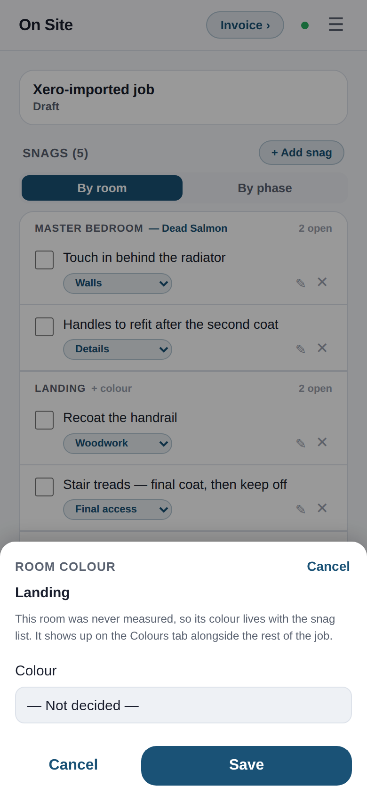

Under the field, the colours already on this job are one tap each. A name the
library has never heard of is fine too — type it and it's yours; the dropdown
also offers to **save it to your colour library** with a brand and code, so
it's there for the next job. **Clear colour** puts a room back to undecided
without losing the colour itself.

**Rooms that aren't one colour.** Most rooms aren't — the walls one thing, the
ceiling another, the woodwork a third. Switch the sheet to **By surface** and
you get a field each for walls, ceiling, woodwork, feature wall and panelling:

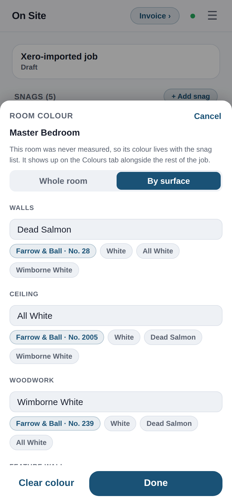

The heading then names each one — *Master Bedroom — Walls Dead Salmon · Ceiling
All White · Woodwork Wimborne White* — and each surface shows up on the Colours
tab in its own right, exactly as a measured room's would. **Whole room** and
**By surface** are either/or: setting one clears the other, so a room only ever
has one answer. Measured rooms already worked this way; this just brings the
ones you never measured into line.

Once a room has a colour it shows on the heading (**Landing — Dead Salmon**)
and joins the **Colours** tab alongside everything else, marked *from the snag
list* so you can tell it apart from a room you measured. Rooms still waiting
on one are listed there too, under **Snag rooms — no colour yet**, so you can
work through them from either screen.

A room you *did* measure works the other way round, unchanged: its colour comes
from the Colours tab and the snag heading just shows it. There's only ever one
place a given room's colour is set.

#### Snags and signal

Snags sync exactly like the rest of On Site — tick things off in a house with no bars and every change queues on the phone and goes up when you're back in signal, same as your materials and your logged days. The sync dot in the corner counts them with everything else.

### Extra work in a room you already measured

The bullet above covers the client asking for *another room*. This covers the commoner one: **"while you're here, can you do the radiators in these two?"** — extra work inside rooms you measured and quoted months ago.

Just add it where it belongs. Open the room on **Measure**, put the radiators in, and save it as you normally would. The app does the noticing:

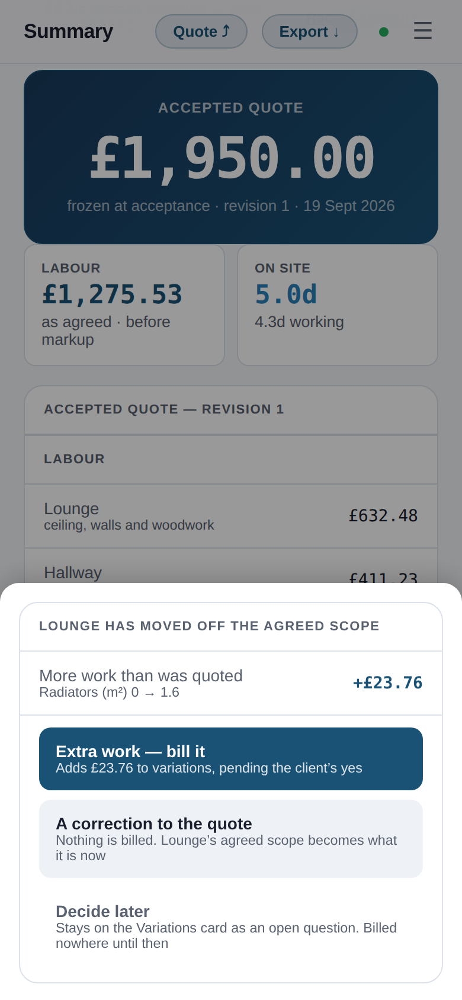

It knows because, at the moment the quote was accepted, it froze a copy of **what every room was measured as** — not just what the job was worth. So when you save a room that's grown past that, it can price exactly the difference, name the field that changed, and ask the only question it can't answer for you:

- **Extra work — bill it.** The difference becomes a variation line, *Lounge — extra work*, priced through the same engine as everything else and sitting on the Variations card with the rest. Pending until the client says yes, exactly like any other variation.
- **A correction to the quote.** Nothing is billed — you mismeasured, or forgot a wall, and the room's agreed scope becomes what it is now. Recorded with a date so it's a decision, not a gap.
- **Decide later.** It stays on the Variations card as an open question, billed nowhere until you answer it.

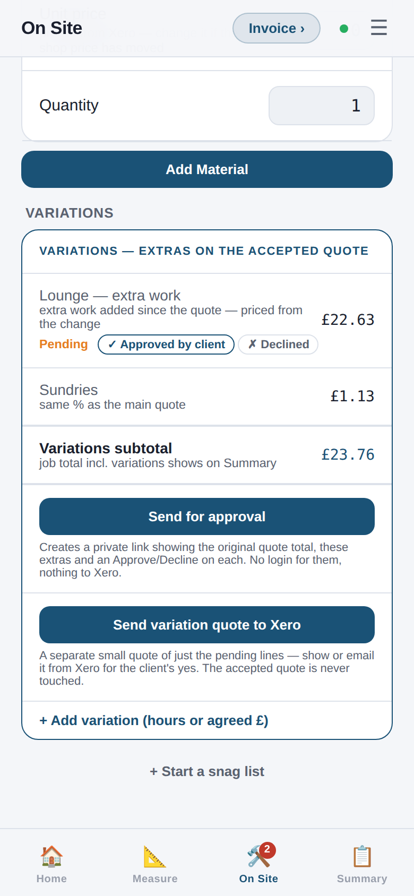

Whichever you pick, **the agreed quote does not move**. The room still bills at what was agreed; the extra bills separately, or not at all. Three things worth knowing:

- **Small changes don't interrupt you.** Under £5 and it goes straight onto the Variations card as an open question rather than throwing a sheet at you on site — but it's never silently swallowed, because that's the money this exists to stop losing.
- **A rate change is never mistaken for extra work.** The difference is worked out by pricing the old scope and the new scope *at the same rates*, so putting your day rate up next month doesn't make every room on every accepted job look like it grew.
- **The kitchen and fitted units ask when you leave the screen** rather than on save, because those forms save as you type.
- **Less work than quoted?** It'll tell you, but a reduction is a credit, not a variation — so the only real answer is **A correction**, and a genuine credit is agreed by amending the quote.

On Measure, a room carrying an extra is chipped **+ EXTRA**; one with a change nobody's ruled on yet is chipped **SCOPE ?**.

**If the frozen scope ever goes missing.** That copy of what a room was measured as is saved with the room, and the room is saved separately from the job itself — so in rare cases (a save lost in a dead spot, a job opened on a second device before it had synced, a restore) a room can come back without it. Without the copy there is nothing to compare against, so the app can't work out what the extra was worth. It says so rather than going quiet: the room is chipped **EXTRA ?** in red on Measure, and the Variations card carries a red row at the top naming it, with the figure the client approved for it if they'd already said yes. **Put this right** gives you two answers — put the agreed figure back as a priced line (prefilled with what they approved), or write it off, which re-agrees the room as it now stands and bills nothing. It deliberately doesn't put the money back on its own: with the frozen copy gone, the room's own line on the final invoice still has that extra work inside it, so adding a variation line automatically would bill the same work twice.

**If you edit that room again afterwards** — a fourth radiator, say — the extra re-prices itself. If the client had already approved it, the card says so: *"Changed since sign-off — £22.63 agreed, £29.47 now."* It doesn't quietly throw away their answer; it tells you the figure moved so you can go back to them or leave it.

**Jobs accepted before this existed** get their frozen scope the first time you open them, taken from the job as it stands that day — so anything already typed in is treated as agreed, and it's changes from then on that get tracked.

### Let the client approve extras themselves

Under the Variations card, **Send for approval** creates a private web page for this job and puts the link on your clipboard — text it, WhatsApp it, or email it to the client.


They open it on their phone. No login, no app to install:


The page shows **the original quote as a single total** (never the itemised breakdown — they've already had that document), then every extra since, with **Approve** and **Decline** buttons on the ones still waiting. The total at the bottom is the original quote plus the extras they've said yes to — pending ones aren't in it, so the figure is never a bill for work they haven't agreed to.

A few things worth knowing:

- **Their answer comes back to you.** Tap **Check answers** on the card, or just reopen the job — the app pulls their taps in and sets the line's status for you, with a note saying it came from the link. If *you* already recorded an answer by hand, yours stands: the person who was there wins.
- **Nothing goes to Xero.** This is entirely separate from **Send variation quote to Xero** below it. Approved extras still reach Xero the usual way — as lines on the final invoice.
- **Prices are frozen once they answer.** Re-measure a room after the client approved that extra and the page keeps the figure they agreed to. Tapping **Send for approval** again updates the same page — it never creates a second link — and refreshes the prices only on the extras still awaiting an answer.
- **Withdrawing an extra.** Remove or unflag a variation and it disappears from their page next time you send — unless they'd already answered it, in which case it stays as the record.
- **The link is the password.** Anyone with it can see this job's totals and answer its extras, so treat it like the quote itself. It's specific to one job and doesn't expire.
- **What the client can reach.** The link only opens that one job's page. But it's the same web address the app runs on, so if someone trims the link back to the domain they land on the app's front door — which is why setting the app password matters (see [Getting started](#1-getting-started)): with it set they get a sign-in screen and nothing else, and it costs you one login per phone, not one per opening. A custom domain makes the link read as your business rather than as a hosting provider, but it doesn't change what's behind the front door — the password does.

When the work's done, tap **Mark Completed** — the job moves on, and Home reminds you it needs invoicing until you do.

---

## 13. The final invoice

On a **Completed** job, On Site shows **Build final invoice**. The builder assembles the whole money story in one list:

- labour **as quoted** (the frozen accepted figure, not the hours it took),
- plus **approved variations** (including the ones the client approved on their own link),
- plus the **actual materials** used (from your ticked-off list),
- minus any **deposit already recorded and synced to Xero**.

The invoice's lines are worded the same way the quote's are (see §9): the
invoice version of your template block rides the **first work line**, and the
work lines after it read *"Bedroom - same as above"* or carry their own scope
where they differ. **Lines that aren't measured work are left to speak for
themselves** — *Sundries & Consumables*, a custom line you typed a price into,
and the diary-day/price rounding line. They're a percentage or a price of their
own, not painting, so they never get the block and never read "same as above".

Review the lines, adjust anything, then send — the app writes **one draft invoice into Xero** and marks the job **Invoiced**. You approve and send the invoice from Xero as usual, so nothing goes to the client without your say-so. Applying the recorded deposit to this invoice, once it exists in Xero, is still done in Xero.

Once a job is Invoiced, Summary shows a read-only **Job Profitability** card telling three separate stories: **Billing** (quoted vs invoiced, with a note if they differ), **Schedule** (days quoted vs days actually logged), and **Materials** (quoted materials vs the real trade cost of what was used, with your markup on materials banked as its own figure). It's reference only — nothing here feeds back into pricing.

---

## 14. Rates

Menu (☰) → **Rates** — every number the calculator uses, grouped by what it prices. A change here applies to every future calculation, and reprices any open (un-accepted) draft immediately — accepted quotes are unaffected, since [their figures are already frozen](#once-a-quote-is-accepted-its-figures-freeze).


| Section | Card | What's in it |
|---|---|---|
| Paint Coverage | **Coverage Rates** | Standard m²/litre per surface, the spraying uplift %, and per-product rates that beat the standard figure for a specific paint range |
| Paint Coverage | **Exterior Paint Coverage & Areas** | Assumed areas and coverages behind exterior litres |
| Labour Times | **Time Rates** | Minutes per m² (or per item) for every surface, doors/frames, sills, mist, panelling, staircase parts |
| Labour Times | **Exterior Rates** | Minutes per coat for masonry, fascias, windows, doors, garage, sash extras, access uplifts |
| Item & Job-Type | **Doors & Frames** | Paintable areas per face, fire-door surcharge, ironmongery prices |
| Item & Job-Type | **Wallpaper Rates** | Per-roll rates, ceiling/staircase multipliers, minimum price, wide vinyl & mural rates |
| Item & Job-Type | **Kitchen Rates** | The full price matrix per item type × size, linear rates, carcass %, strip-original-coating minutes |
| Item & Job-Type | **Fitted Unit / Shelving** | Shelf and bay spray times, fallback areas behind fitted-unit litres |
| Scheduling | **Scheduling** | Daily overhead, schedule buffer, Work Saturdays, bank-holiday region, calendar feed |

> **Calibrate as you go:** after a few jobs, compare the logged time and actual materials on On Site with what was estimated, and nudge the time and coverage rates here. The estimates get sharper with every job.

---

## 15. Settings

Menu (☰) → **Settings**. Everything that isn't a calculation rate lives here: your business identity, pricing defaults, Xero, and backup.


| Section | What's in it |
|---|---|
| **Business** | Your business name and logo — shown in the app header, on the sign-in screen, at the top of every quote you send and its PDF, and in the calendar feed |
| **Pricing** | Day rate, hours per day, markup %, sundries %, spray sundries bump, deposit %, commercial job adjustment, standalone-job rounding (full or half days), and how many days before an unanswered quote gets flagged |
| **Deposits (Xero)** | The bank account a recorded deposit lands in, and the account code it posts to |
| **Xero Integration** | Connect / disconnect |
| **Materials (Xero Items)** | Refresh your product list from Xero and set the default product for each role |
| **Quote & Invoice Text** | The per-job-type wording templates for quotes and final invoices |
| **Calibration** | What your finished jobs say about two of your settings — see below |
| **Appearance** | Light / Dark / Auto theme (this device only) |
| **Backup** | Export and import everything — see below |

### Calibration — let finished jobs correct your settings

Some of the figures behind your prices started life as sensible guesses. This card
compares them against what actually happened on your last few finished jobs.


**Days on site** adds up the days you logged on *On Site → Time on site* and compares
them with the days those jobs were quoted for. If you're consistently running over, the
percentage is the **Schedule buffer** you should probably be padding quotes with.

**Sprayed wall paint** does the same for tins: on jobs where at least one room had
**Spray walls** on, it compares the wall paint the estimate asked for against what you
logged as used, and turns the difference into a **Spraying uplift** figure.

Three things worth knowing:

- **Jobs with nothing logged are left out completely** — not counted as zero. A job you
  never logged days for says nothing about how long jobs take, so it isn't allowed to.
  The card tells you when it has left jobs out, and why.
- **Nothing changes until you tap Adopt.** Adopting sets that one setting for quotes from
  now on. No quote, invoice or finished job is re-priced — accepted quotes are frozen
  anyway.
- **Change "Jobs to look at"** to widen or narrow the sample. Eight is a reasonable
  default; drop it to 3 if you've recently changed how you work.

If a suggestion says *"not enough data yet"*, it's telling you what's missing — usually
that no sprayed job in the sample has its materials logged. It'll appear on its own once
the data does.

The sundries % and the exterior assumed areas aren't offered here, and that's deliberate:
nothing in the app tracks what you actually spend on sundries, and an exterior paint
overrun could be the assumed area or the coverage rate — there's no way to tell which.
Those stay your judgement call.

---

## 16. Backups

Settings → **Backup**:

- **Export everything** downloads a single JSON file containing every job, room, setting and colour. Do this regularly — Home will nag you when the last backup is getting old.
- **Import backup** restores from a file, adding to what's already there — imported jobs get fresh identities, so it can never overwrite existing data. Restoring settings is a separate opt-in on the import preview, since it's the one thing an import *can* overwrite. Backup files up to 64MB are accepted, which is far more than a full job history comes to; if anything is ever wrong with a file, the app now tells you what in plain English rather than showing a syntax error.

---

## 17. Tips & troubleshooting

**The dot** in the top bar is your sync status: green = everything saved to the server, amber = saving now, red = offline. If you lose signal mid-measure, keep working — changes are kept on your phone ("Offline — N changes queued on this phone") and pushed up when the connection returns; the menu's sync line confirms with "All changes synced ✓".

**Opening the app with no signal.** The app keeps a copy of itself on the phone, so it opens in a dead spot exactly as it does anywhere else — everything you've measured is on the phone, not fetched from the server. It has to have been opened *once* somewhere with signal first, to save that copy; if it hasn't, you'll get a short page saying so rather than the browser's "no internet" screen.

If you've had launches that hung on a blank screen in a dead spot, that's fixed as of v2.61.0. The cause was a phone showing a bar of signal with nothing actually getting through — not the same as being cleanly offline, and the app used to sit waiting on it. It now gives the network a few seconds and then opens from the phone's own copy. The same deadline applies to saving: a change made where the signal is dead is queued on the phone within seconds instead of hanging, so the dot goes red and tells you what's waiting rather than sitting on amber.

**Starting a job with no signal.** You can now do this too — pull up outside a house with no bars, add the job, and measure straight into it. The job is created on the phone and appears on the server when you're next in signal, along with everything you put in it. (Before v2.61.0 nothing happened when you tapped it.)

**Switching jobs with no signal.** A job is kept on the phone once you've opened it in signal, so you can switch between the jobs you've been working on with no bars at all and each one comes back with its own rooms, colours and materials. The last dozen jobs you've opened are kept; older ones drop off and reload the next time you open them in signal.

If you try to switch to a job this phone hasn't got a copy of, it now tells you so and stays where it is — rather than opening the job looking empty. That matters: before v2.62.0 it opened with every room gone, and anything you then measured would have replaced that job's real rooms on the server when the signal came back. If you see that message, the job is fine — the phone just hasn't downloaded it yet.

**A price looks wrong?** Work backwards: room Preview → Summary breakdown → Rates. The calculation is always *areas × time rates × day rate*, plus *areas ÷ coverage = litres → tins*, plus sundries and markup. One of those numbers will be the culprit — usually a coverage or time rate that doesn't match how you actually work. If the job is already **Accepted**, remember its figures are frozen — a rate change won't move it; you'd need **Amend → revision N+1** on Summary.

**Xero button not working?** Tokens occasionally expire for good if the app hasn't talked to Xero in a long while. Settings → Disconnect Xero → Connect Xero puts it right in under a minute.

**Sent a quote, then client wants changes?** Just edit the rooms and hit **Update quote Q-nnn in Xero** on Summary — same quote number, new figures.

**Materials you added by hand not in the total?** Check the row's tag on Summary's materials list. A line tagged **Tracking only** is deliberately left off the quote — tap the tag to make it **Chargeable** and it joins the subtotal, the Xero quote and the deposit straight away. The card also prints *"Tracking only — not on the quote"* with a figure whenever anything on the list isn't being billed, so you can see at a glance whether money is sitting outside the price. (Lines added before September 2026 may have been saved as tracking-only by default — one tap each puts them on.)

**Extra work mid-job?** Always add it as a **Variation** rather than editing the accepted rooms — the original quote stays honest, and the extra shows separately on the final invoice where the client expects to see it.

**Recording a deposit but the option's greyed out?** A linked Xero contact is required before you can sync to Xero — the app will point you at Sync to Xero on the client details. You can still record the deposit locally in the meantime.

**The build number** at the bottom of the ☰ menu is how you check a new version has actually reached your phone after a deploy.

---

*Manual for NH Estimator v2.73.2. Screenshots taken from the app with example data.*

*Keeping this manual up to date: edit this file, then run `npm run build:manual` to regenerate the PDF edition ([NH-Estimator-User-Manual.pdf](NH-Estimator-User-Manual.pdf)) and commit both together. The cover picks up the app version and date automatically.*
