# NH Estimator — User Manual

*A pocket guide to the Nicky Hawkins paint-estimating app, from first measure to final invoice.*

NH Estimator is a phone-first web app for pricing decorating work. You walk round the property measuring up, and the app turns those measurements into a fully priced quote — labour, materials, markup, deposit and payment plan — which you can send straight into Xero. Once a quote is accepted, the same app schedules the job, tracks the materials and time you actually use on site, and builds the final invoice back into Xero when you're done.

This manual follows the life of a job in order: **set up → measure → quote → schedule → on site → invoice**. If you're brand new, read [Getting started](#1-getting-started) and [Measuring up](#3-measuring-up) first — the rest will make sense as you need it.

---

## Contents

1. [Getting started](#1-getting-started)
2. [Finding your way around](#2-finding-your-way-around)
3. [Measuring up](#3-measuring-up)
4. [Kitchen cabinet respray](#4-kitchen-cabinet-respray)
5. [Fitted units](#5-fitted-units)
6. [Custom line items](#6-custom-line-items)
7. [Colours](#7-colours)
8. [Price Lookup & Shopping List](#8-price-lookup--shopping-list)
9. [The quote (Summary)](#9-the-quote-summary)
10. [Jobs](#10-jobs)
11. [Schedule](#11-schedule)
12. [On Site — running the job](#12-on-site--running-the-job)
13. [The final invoice](#13-the-final-invoice)
14. [Rates](#14-rates)
15. [Settings](#15-settings)
16. [Backups](#16-backups)
17. [Tips & troubleshooting](#17-tips--troubleshooting)

---

## 1. Getting started

### Install it on your phone

The app lives at your own web address (the one on your Render account). It's designed to be **installed to your home screen** so it opens full-screen like a normal app:

- **iPhone:** open the app in Safari → tap the Share button → **Add to Home Screen**.
- **Android:** open it in Chrome → menu (⋮) → **Add to Home screen** / **Install app**.

If your copy of the app has a password set, you'll be asked for it the first time you open the app on a device — after that it stays signed in. If there's no password on your instance, guard the web address like you would any private page.

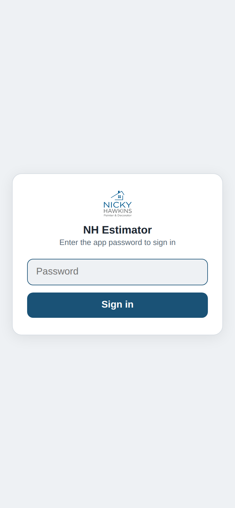

### Connect Xero (one-off)

Almost everything works without Xero, but quoting and invoicing shine with it connected:

1. Open the menu (☰) → **Settings**.
2. Scroll to **Xero Integration** → tap **Connect Xero** and sign in.
3. Back in Settings, under **Materials (Xero Items)**, tap **Refresh from Xero** to pull in your paint products, then pick your default products (wall paint, ceiling, woodwork, primer, mist coat, masonry…). Every new room starts with these defaults, so set them once and forget them.
4. If you plan to record deposits through the app (see [Recording a deposit](#recording-a-deposit)), also pick a bank account under **Settings → Deposits (Xero)**.

### Check your rates

The app ships with sensible defaults (day rate £300, 20% markup, 25% deposit, standard coverage rates), split across two screens off the menu: **Rates** holds the calculation tables, **Settings** holds everything else. Skim through both once and adjust anything that doesn't match how you price — every figure in a quote comes from these numbers.

---

## 2. Finding your way around

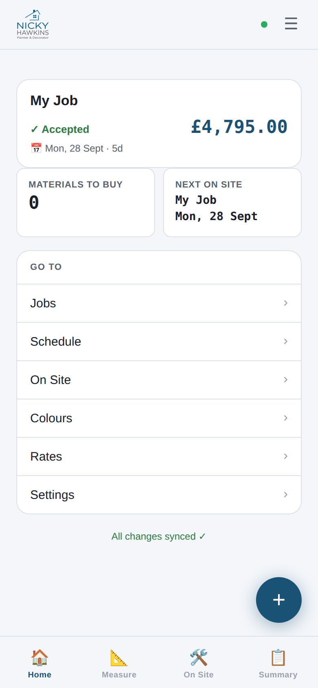

The **Home** screen is your morning glance: the current job and its status, a **Materials to buy** count, what's **next on site**, and shortcut links. When something needs chasing — a quote that's gone unanswered too long, a finished job you haven't invoiced — it appears at the top of Home as an attention strip.

The **bottom bar** is always visible and follows the life of a job, left to right:

| Tab | What it's for |
|---|---|
| 🏠 **Home** | Dashboard and reminders |
| 📐 **Measure** | Everything measured for the current job — rooms, exterior items, kitchen, fitted units and custom lines |
| 🛠 **On Site** | Time, materials and variations while the job runs |
| 📋 **Summary** | The priced quote, Xero, and job status |

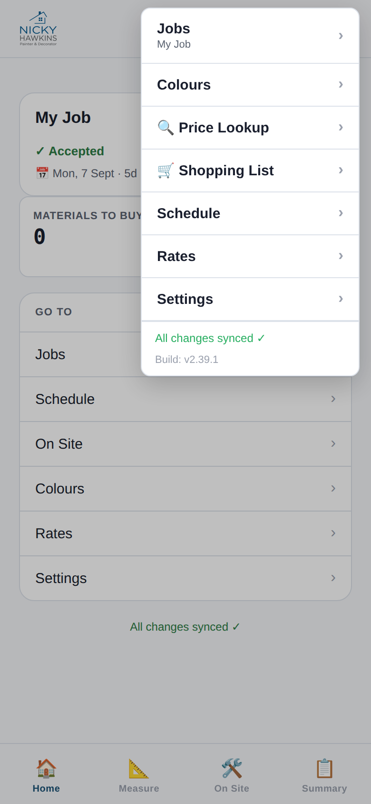

The **menu (☰)**, top right on most screens, holds every other screen:

| Item | What it's for |
|---|---|
| **Jobs** | Switch jobs, start a new one, import a pre-app Xero quote |
| **Colours** | The job's colour schedule and paint-ordering quantities |
| **🔍 Price Lookup** | A till-check: search any Xero sales item for its price |
| **🛒 Shopping List** | A running pick-up list, separate from any one job |
| **Schedule** | The job calendar |
| **Rates** | Every number behind a calculated price |
| **Settings** | Business details, Xero, backup, appearance |

Below those, **↩ Undo** appears whenever there's a recent change on the current job you can undo (see [Materials & Undo](#materials--undo)), followed by the sync line — "All changes synced ✓" means everything you've entered is safely on the server — and the build number, so you can confirm a deploy has actually reached your phone. Everything saves automatically as you type; there is no save button to forget.

---

## 3. Measuring up

Open **📐 Measure**. This screen lists everything measured for the current job — **Interior** rooms, **Exterior** items, the **Kitchen**, **Fitted Units** and **Custom Lines** — each showing its cost and estimated days at a glance. The figures on this screen are your *labour cost before markup* (the banner at the top says so); the chip in the top bar shows the customer-facing quote total, and Summary has the full customer-facing breakdown.

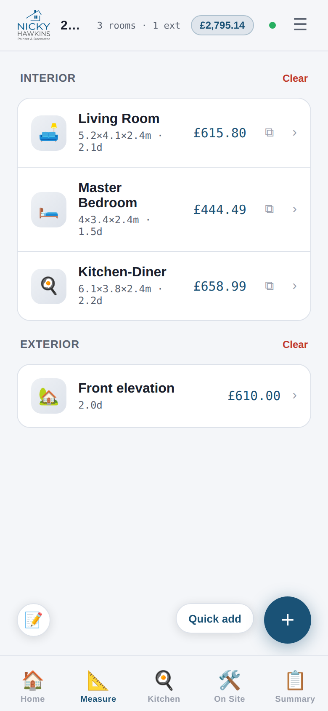

Tap the **`+` button** (bottom right) and choose what you're adding:

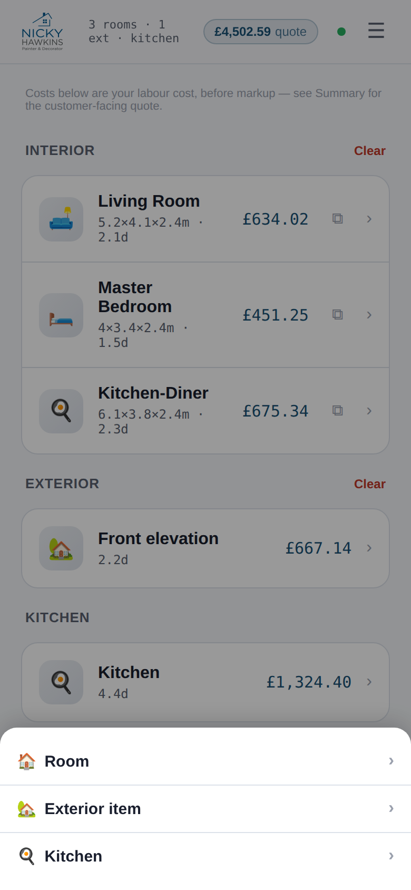

> **Quick add:** walking a big house? Tap **Quick add** instead and just type the room names one after another — Living Room, Hall, Bedroom 1… — then go back round measuring each one on a second pass. Much faster than filling in a full form in every doorway.

### Bulk edit

Once there's more than one room, **Bulk edit** appears on the Interior header. Tap it and every room gets a tick box — pick the ones you want (or **Select all**), then **Edit N rooms**:

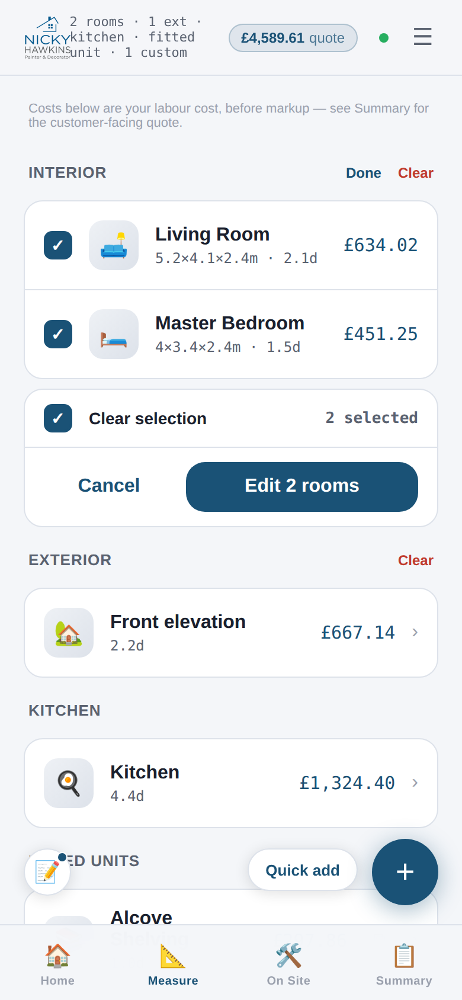

The panel that opens covers the fields worth doing in one go: a product and colour band for each of the seven paint roles (walls, ceiling, woodwork topcoat, woodwork primer — with a **None** option for a self-priming topcoat — mist coat, feature wall and panelling), coat counts for walls/ceiling/woodwork/doors/frames, a mist coat toggle for walls and ceiling, and the room's prep level (which covers doors and frames too):

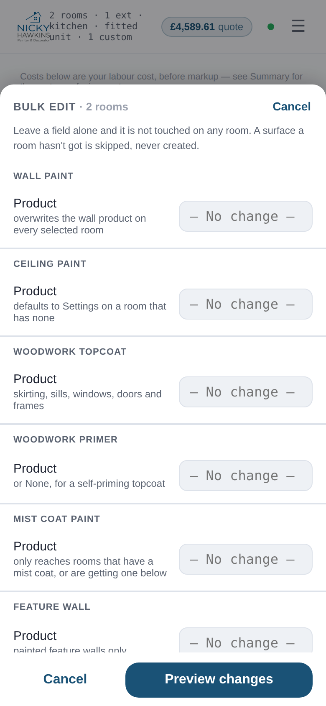

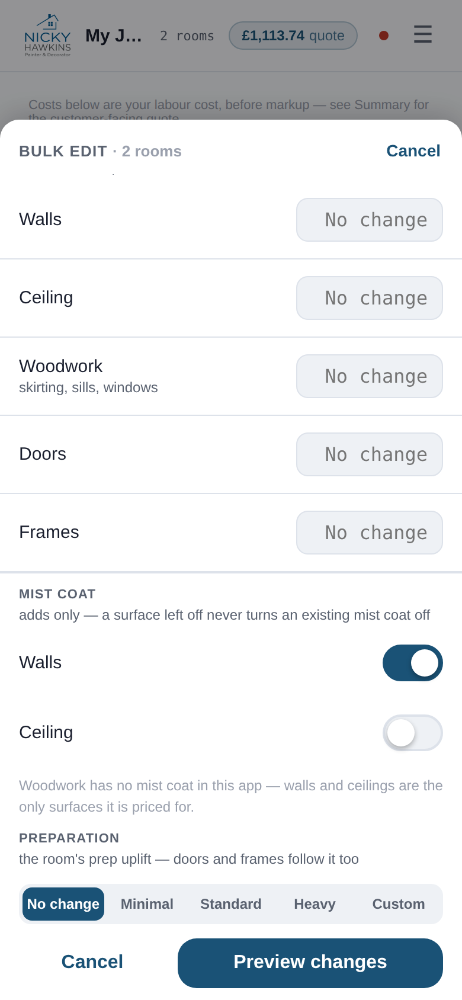

**Every field starts on "No change" and stays there unless you set it** — nothing carries over from the last time you used it, and a field you don't touch is left alone on every room. Two rules worth knowing: it **never invents a surface a room hasn't got** (ask for woodwork coats and a room with no woodwork is skipped, marked N/A in the preview), and **mist coat only ever adds** — ticking a surface turns it on where it's off, but leaving it unticked never turns an existing mist coat off. Coats work the other way and the form says so: the number you type is the exact coat count, not an increase.

Tap **Preview changes** to see exactly what would move, room by room, `old → new`, before anything is written:

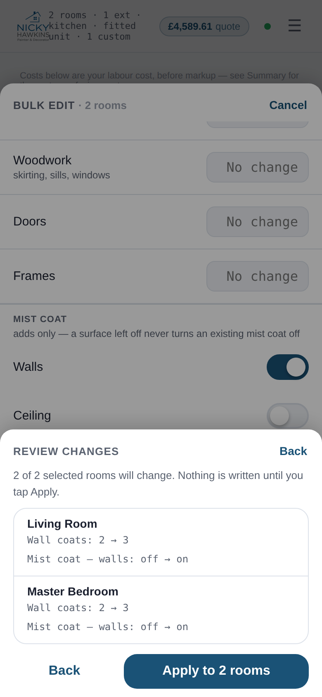

Nothing is saved until you tap **Apply**; **Back** returns to the panel with every field still set. Afterwards the rooms are ordinary rooms — open any one and edit it as normal, nothing is locked. Staircase/HSL rooms take part too, but only for the fields that actually move their price: door coats, frame coats and every product override apply normally, while wall/ceiling/woodwork coats, the mist toggles and the prep level are skipped (a staircase room's total is worked out and frozen when you save the staircase form itself — change those on the staircase form instead).

Rooms and fitted units can also be **duplicated** — tap the ⧉ icon on their card in the Measure list. Everything copies: dimensions, coats, prep, colours and products, dropped in right below the original as "(copy)". This is the fast way to do bedrooms 2/3/4, or two matching alcove units either side of a chimney breast — measure one, copy it, change a couple of numbers. A copy always starts its own client sign-off from Pending (it never inherits the original's ✓), and on an accepted job it arrives flagged as a variation, same as anything else added after acceptance.

### Adding a room

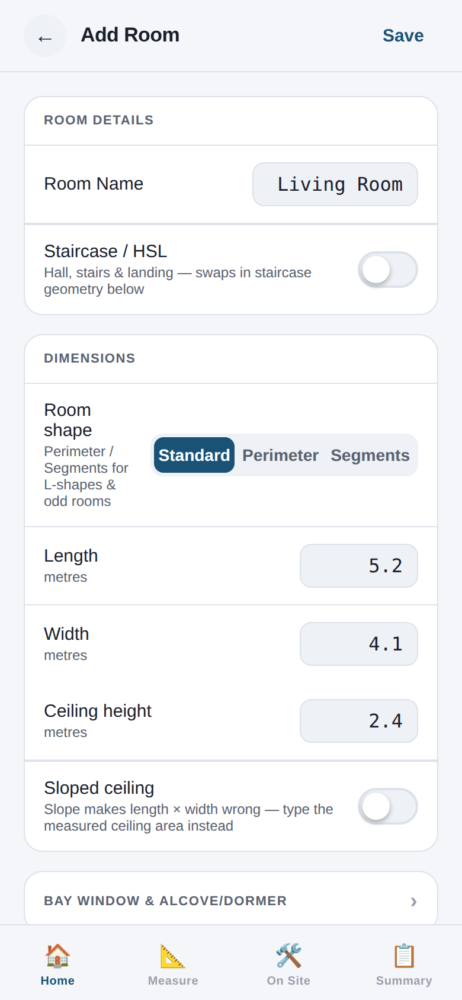

The form is in two halves, and it follows how you actually work: **walk the room** first — every card that asks you to look at something and count it — then **decide the scheme** once at the end, in the last three cards. Nothing makes you jump back and forth between measuring and pricing while you're stood there with a tape.

**Every card is collapsed when the form opens**, so what you see first is a short index of the room rather than a page to scroll past — tap a heading to open that card, tap it again to fold it away. The two exceptions are at the top: **Room Details** (the room name and the Staircase / HSL toggle) is always on screen, since you touch both on every room, and **Dimensions** starts open because you fill it in every time. Dimensions is still an ordinary section, so once you've measured you can collapse it too and keep the rest of the form in view.

Only the top matters for a basic room:

1. **Room Name** — e.g. "Living Room".
2. **Dimensions** — pick the **Room shape** first:
   - **Standard** — length × width × height, for a plain rectangular room (the default).
   - **Perimeter** — type the wall perimeter and ceiling height directly, plus the ceiling area, when the footprint doesn't reduce to L×W.
   - **Segments** — build the room from rectangular zones (each L×W) that sum into the wall run and ceiling area — made for L-shapes and rooms with big alcoves.

   In any mode, the **Bay Window & Alcove/Dormer** add-ons cover the common awkward bits: bay window extra perimeter, alcove/dormer wall and ceiling area, and a sloped-ceiling toggle (type the measured ceiling area directly, since a slope makes length × width wrong). So loft rooms and bays no longer need fudged numbers. (The **Staircase / HSL** toggle above swaps this card for staircase geometry — see [Staircases](#staircases-hall-stairs--landing) below.)

   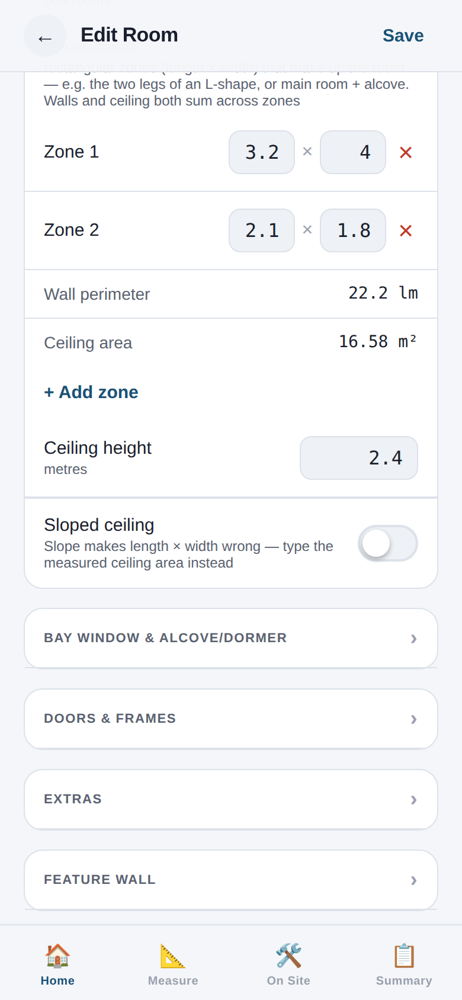

#### Walk the room

The rest of the measuring cards follow in the order you'd meet them moving round the room — all optional, all collapsed until you tap them, and you skip whatever the room hasn't got:

- **Doors & Frames** — doors and their frames are priced as separate line items, each with its own quantity and coats:

  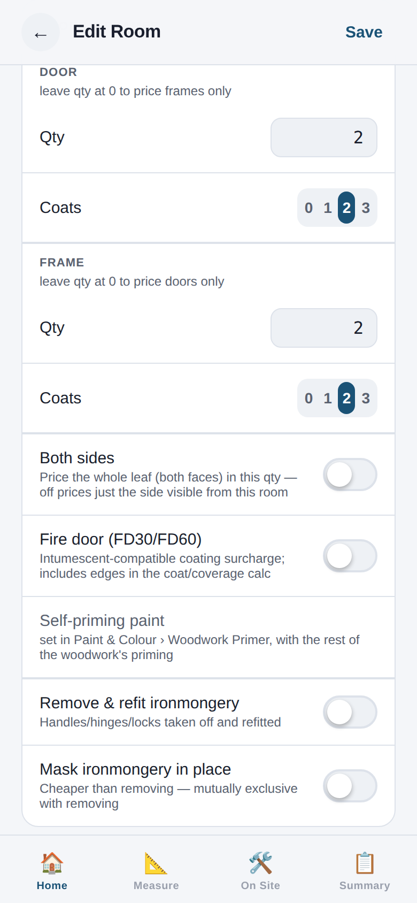

  Leave a Door or Frame's quantity at 0 to price just the other one. Their prep comes from the room's **Preparation** card — there's one prep decision per room, not a separate one here. Per line you'll also find **Fire door** (an FD30/FD60 intumescent-compatible surcharge, edges included in the coverage calc), **ironmongery** (remove-and-refit, or mask-in-place — mutually exclusive), **Self-priming paint** (skips the primer coat for one extra topcoat instead — once the paint has a Coverage Rates entry in Rates with Self-priming set, that entry takes over and this toggle is replaced by a note), and **Both sides** (price the whole leaf as one line instead of just the face seen from this room — handy for a door between two painted rooms, split one face each).
- **Extras** — windows (m²), window sills and radiators. Each adds its own time and paint.
- **Feature Wall** — one wall in a different finish: paint, or wallpaper (standard, wide vinyl or mural).
- **Wallpaper** — lining and finish paper for walls or ceiling, priced per roll with an automatic **rolls-to-order** count, plus a free-text note for the paper itself. Covered in detail in [Wallpaper](#wallpaper--rolls-to-order) below.
- **Excluded Walls** — walls you're *not* painting (a tiled wall, wallpaper that's staying). Add its width × height and it's deducted.
- **Panelling** — wall panelling by area with its own coats (up to 4), prep and colour, independent of the room's own settings.
- **Mist Coat** — for fresh plaster; tick walls and/or ceiling, with a manual area override for "only part of it is new plaster".

#### Decide the scheme

Once you've stopped measuring, the last three cards are the pricing decisions — made once, with the room already captured:

- **Coats** — walls, ceiling and woodwork each default to 2. Set any of them to 0 to skip that surface entirely (e.g. ceiling not being painted). Below the coat counts sit three independent **spray toggles** — one per surface:

  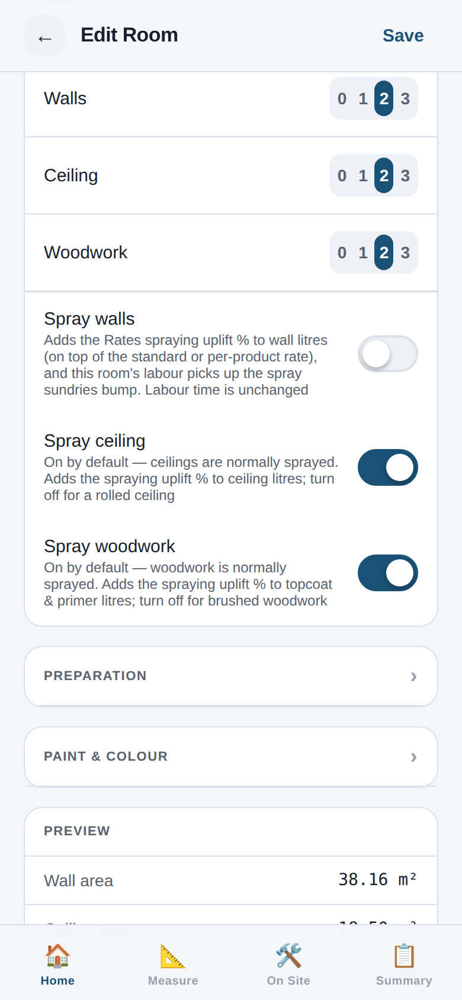

  **Spray walls** is off by default (also adds the spray sundries bump for the extra masking); **Spray ceiling** and **Spray woodwork** are on by default, since ceilings and woodwork are normally sprayed. A surface's toggle adds the Rates spraying uplift % to its litres on top of the standard or per-product rate — labour time is unchanged either way.
- **Preparation** — Minimal / Standard / Heavy, or a custom percentage. This scales labour across the whole room, doors and frames included. **Making Good** adds a fixed £ amount for repairs.
- **Paint & Colour** — each surface takes your default product from Settings; override the product, colour band or colour here when a room is different.

Two cards at the bottom sum up what you've entered:

- **Preview** — the live estimated cost and time, updating as you type.
- **Paint Needed** — how many litres this room takes, per surface, at your coverage rates (with each surface's spray uplift already included, rounded up to the half litre):

  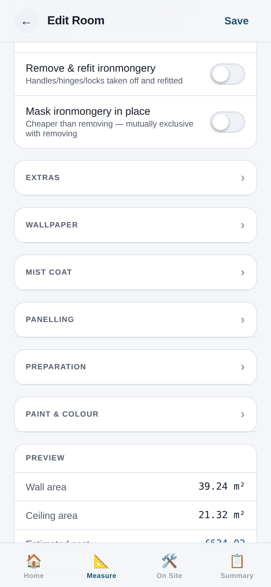

  These are the same figures Summary's materials list buys from — a feature wall in the room's own colour and product folds into the Walls line rather than getting its own row, since that's one tin of paint bought once.

### Staircases (Hall, Stairs & Landing)

Stairwells are the hardest thing to measure by hand — big raking walls you can't get a tape across, hall and landing running into each other. The app does the geometry for you. Flick the **Staircase / HSL** toggle at the top of the room form and the Dimensions card is replaced with staircase geometry:

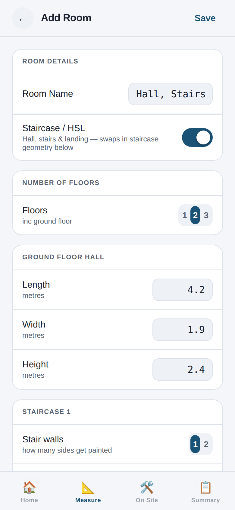

Work down the cards:

1. **Number of Floors** — 1, 2 or 3 including the ground floor. A typical two-storey house is **2**: ground-floor hall, one staircase, first-floor landing. Choose 3 and a second staircase and landing appear.
2. **Ground Floor Hall** — plain length × width × height, like any room.
3. **Staircase 1** — this is where the app earns its keep:

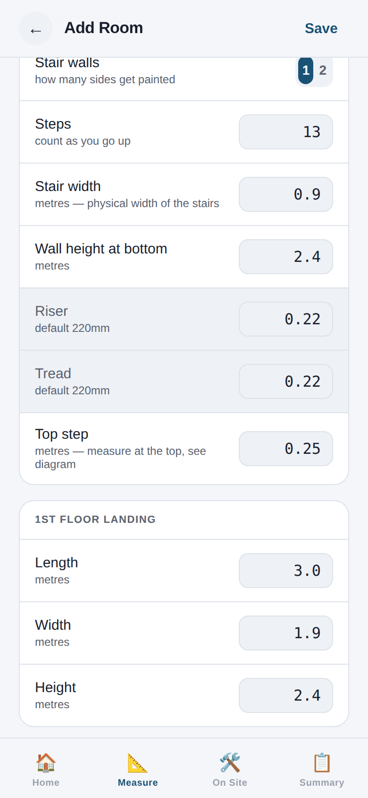

- **Stair walls** — how many sides of the staircase get painted (1 or 2).
- **Steps** — count them as you go up.
- **Stair width** — the physical width of the stairs.
- **Wall height at bottom** — floor to ceiling at the foot of the stairs.
- **Riser** and **Tread** — pre-filled with the standard 220 mm; only touch these on an unusual staircase.
- **Top step** — the one measurement people get wrong, so it has its own diagram:

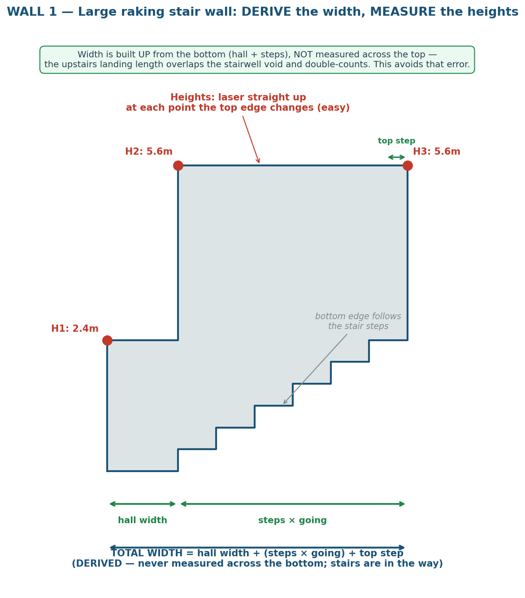

The trick, as the diagram shows, is that the big raking stair wall's width is **derived, never measured**: hall width + (steps × going) + top step. Measuring across the top instead double-counts the stairwell void; measuring along the bottom is impossible because the stairs are in the way. You measure only the easy things — heights straight up with a laser — and the app builds the wall from the step geometry.

4. **1st Floor Landing** (and 2nd, for three floors) — plain length × width × height again.
5. **Staircase Details** — spindles, newel posts and their woodwork coats. These are priced per piece, with their own timings editable under Rates → Time Rates.

The **Staircase Areas** card at the bottom shows its working — so you can see exactly what you're pricing and sanity-check it against the space you're standing in:

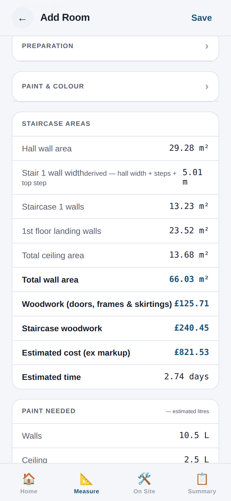

Here the derived stair wall width is 5.01 m (1.9 m hall + 13 steps × 0.22 m + 0.25 m top step), giving 13.23 m² of raking stair wall on top of the hall's 29.28 m² and the landing's 23.52 m² — a 66 m² job in total, priced at 2.74 days, without a tape measure going anywhere near the stairwell.

### Wallpaper & rolls to order

Any room (including a staircase) can have wallpaper on the walls, the ceiling, or both. Open the **Wallpaper** section of the room form:

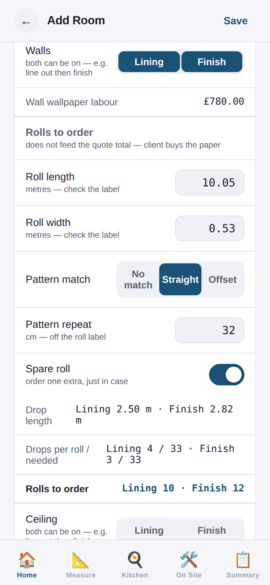

- **Pattern / product note** — free text at the top of the card, for whatever you'll want to know later: the pattern name, the supplier, "paste-the-wall", "heavy vinyl, needs a seam roller". Write it while you're stood in the room looking at the paper, and it's there when you come to order or come back to the job. It's **your note, not the client's** — it never appears on the client quote, the Xero quote or the Colours screen, and it doesn't affect a single figure. Optional; leave it blank if the paper is unremarkable.
- **Lining / Finish** — tap either or both. Both on means "line out, then hang finish paper", and each is priced separately per roll (rates in Rates → Wallpaper Rates). The labour appears immediately.
- **Roll length / Roll width** — pre-filled with the standard 10.05 m × 0.53 m; check the label of the actual paper and adjust.
- **Pattern match** — *No match* (lining papers, plains), *Straight* or *Offset*. A pattern match wastes paper, and the calculation accounts for it.
- **Pattern repeat** — in cm, straight off the roll label.
- **Spare roll** — adds one extra to the order, just in case.

Below the inputs the app shows its working, batch-book style: the **drop length** (wall height plus trim allowance, lengthened to allow for the pattern repeat when there's a match), **drops per roll / drops needed**, and the bottom line — **Rolls to order**. Read that to the client off your phone.

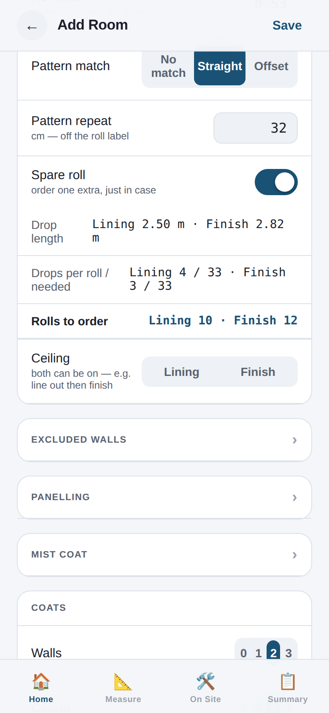

Two things worth knowing:

- The rolls figure is a **buying guide, not a charge** — the labour feeds the quote; the client buys the paper — and the app deliberately doesn't supply it.
- On a staircase/HSL room, wallpaper labour automatically picks up the **staircase multiplier**. Ceilings get their own multiplier the same way.

Besides the standard roll calculation above, two other wallpaper types are available (feature wall only, under Rates → Wallpaper Rates for pricing): **Wide Vinyl** (commercial 137 cm material, priced per metre/area) and **Mural** (printed to the wall size, priced per m² or a flat fee).

### Adding an exterior item

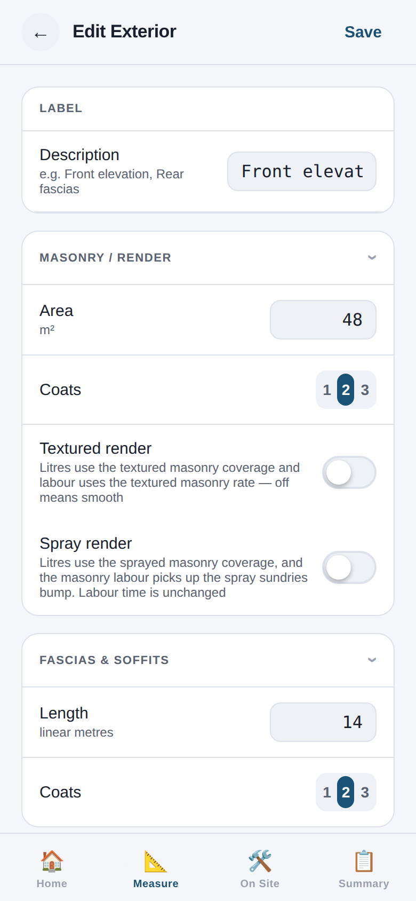

Exterior work is priced per *item* — typically one per elevation ("Front elevation", "Rear + gable") or per job type ("Fascias all round"). Each item is a menu of exterior work; fill in only what applies:

- **Masonry / Render** — area in m² and coats, with toggles for **textured render** (more paint, more time) and **spray render**.
- **Fascias & Soffits** — linear metres and coats.
- **Exterior Windows** — one row per matching group, with panes-per-window and a size band.
- **Exterior Doors & Frames** — same fire-door/ironmongery/self-priming options as interior doors, split the same way.
- **Garage Doors**, **Porch / Feature Door** — priced in days.
- **Sash Window Restoration** — prime & paint plus resin repairs, reglazing, draught-proofing, cords and beads, added per window.
- **Preparation** and **Making Good** — same idea as rooms.
- **Paint Colours** — one masonry colour and one exterior woodwork colour per item.

Access uplifts for 1st floor and 2nd floor+ work are applied per item automatically; the percentages live in Rates. Exterior paint litres are estimated from assumed areas per unit (window, sash, door, garage, fascia width) — calibrate these in **Rates → Exterior Paint Coverage & Areas** as real jobs prove them out.

### Site notes

Tap the **📝 button** (bottom left of Measure) any time to jot job notes — access arrangements, things agreed on the doorstep, snags you spotted. Notes save automatically and stay with the job.

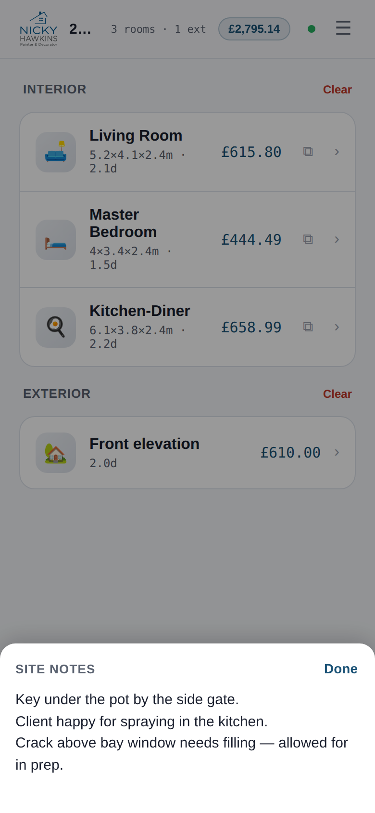

---

## 4. Kitchen cabinet respray

On **Measure**, tap **`+` → Kitchen** to open the dedicated cabinet-spray calculator — one kitchen per job, saved automatically. Once it has anything in it, the kitchen appears as its own priced line in the Measure list and the quote.

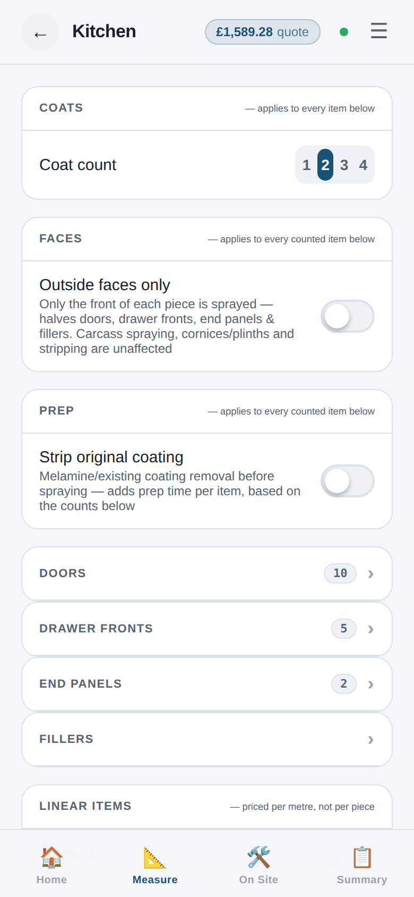

- **Coat count** (1–4) applies to every item below.
- Tap open **Doors, Drawer Fronts, End Panels** and **Fillers** and enter how many of each size (Small / Medium / Large / X-Large). Each size has its own base price and per-coat price — tune them in Rates → Kitchen Rates. Each card shows its piece count on the header once collapsed, so you can shut them all and tally the kitchen at a glance.
- **Linear items** — cornices and plinths are priced per metre.
- **Carcass spraying** — toggle on to add a percentage uplift for spraying the cabinet interiors/carcasses.
- **Colour & Product** — pick the paint for the quote and materials list.

Two cards sit above the item counts and apply across everything below them:

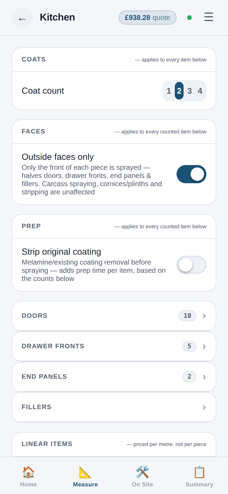

- **Outside faces only** — for jobs where only the fronts are being sprayed. Turn it on and doors, drawer fronts, end panels and fillers are all priced at **half** — the per-piece prices in Rates are whole-piece, both-faces figures, so half is one face. Carcass spraying, cornices/plinths and stripping deliberately stay at full price (the carcasses are the same surface either way; trim has one face to begin with), and the client's quote line reads "outside faces only" so the scope limit is on their copy too. Off by default, so nothing you've already quoted changes.
- **Strip original coating** — for spraying over melamine. Adds stripping time to every piece counted, at your day rate, worked out from the counts already entered — the line beneath the toggle shows the sum it priced so you can check it before it lands in the total. Off by default and the minutes-per-size are editable under Rates → Kitchen Rates.

---

## 5. Fitted units

**+ → Fitted Unit** on Measure — for bespoke built-ins: a bookcase or media unit with open shelving above and cabinet doors below. You can add several to one job, each auto-named "Fitted Unit N" (rename it — "Left alcove", "Media wall unit" — so multiple units read apart on the quote, materials and client view).

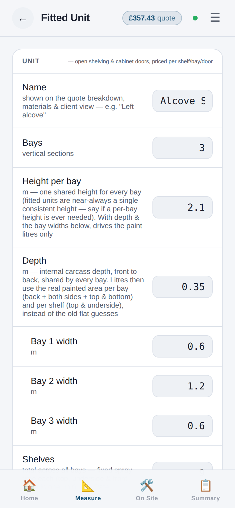

Unlike the kitchen calculator's flat £ pricing, a fitted unit is priced in **minutes**, like rooms and doors, so it stacks properly into the day-rate maths:

- **Bays, Height per bay, Depth** — one shared height and depth for the whole unit (fitted units are near-always a consistent height); a width input appears per bay, so uneven layouts (a wide TV recess between narrower shelf bays) are no problem.
- **Shelves** — total across all bays, priced as a fixed spray time each (top, underside and front edge in one unit).
- **Cabinet doors** — priced at the interior door rate, **one face** by default (a built-in is normally painted from the front only). **Door size** scales this for cupboard-size (½) or wardrobe-size (1½×) doors, and **Both sides** prices the whole leaf — doubling that unit's door labour and litres — for units sprayed inside and out. Shelves and bay carcasses are unaffected by either.
- **Prep Level** — Bare/Primed (full prime + 2 coats) or Existing painted (light key-sand + topcoat, no primer bought).
- **Sprayed finish** — off by default; adds the Rates spraying uplift to the litres.
- **Complexity/Masking** — None / +10% / +20%, for recessed lighting, tight bays or electrics to mask off. Stacks on labour time before markup, same shape as the Commercial toggle.
- **Colour & Product** — defaults to your Settings woodwork topcoat.

The **Breakdown** card shows the priced result before markup, same as a room's Preview.

---

## 6. Custom line items

**+ → Custom line** on Measure — for one-off items that don't fit any pricing model: "Install panelling — £450", or "Extra sheet of ply — £40 × 2".

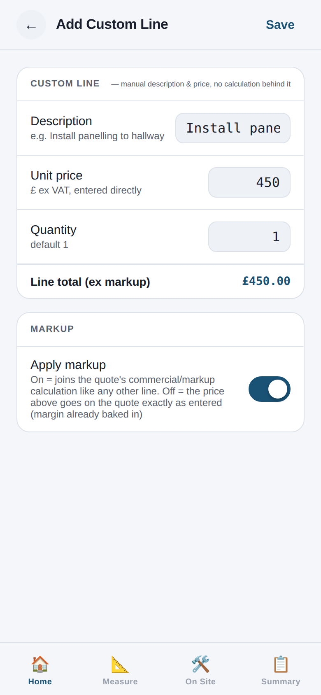

Type a **Description**, a **Unit price** (ex VAT) and an optional **Quantity** (default 1). The **Apply markup** toggle decides how it behaves on the quote: on (the default) joins the commercial/markup calculation like any other line; off, the price goes onto the quote *exactly* as entered — for ad-hoc prices that already have your margin baked in. Custom lines sit in their own section on Measure with a MANUAL tag so they never read as a calculation, are fully editable and swipe-deletable, and flow through to the Summary breakdown, the client-facing Quote view, the Xero quote and the final invoice. No sundries % is added to them either way.

---

## 7. Colours

Menu (☰) → **Colours** — the job's paint and ordering screen. As you and the client settle on colours, note each one here: a label for where it goes, plus brand and colour name from the built-in library of over 1,200 colours across Farrow & Ball, Little Greene, Dulux, Dulux Heritage, Paint & Paper Library and RAL Classic.

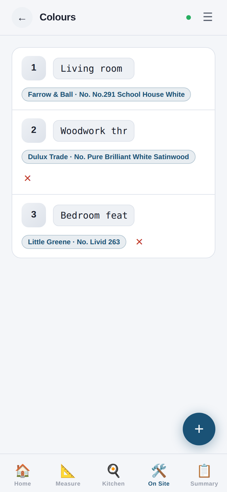

Numbered colour slots are what the room forms' colour chips point at — so "wall colour 1" in a room always means colour 1 on this list. Each colour number shows which rooms and surfaces use it and **how much paint to order** — the same calculation Summary uses, so the two can never disagree. Look here, not at Summary, when you're actually buying paint. Typing a colour name autocompletes from the library, filling in brand and code for the merchant; an unmatched colour can be saved to the library for next time, including the same name under a second brand.

---

## 8. Price Lookup & Shopping List

Two small tools off the menu, independent of any one job.

**🔍 Price Lookup** searches every sales item in your Xero account by name or code and shows what it actually costs at the till — the inc-VAT price, with ex-VAT alongside. It's a read-only till check, not tied to any quote:

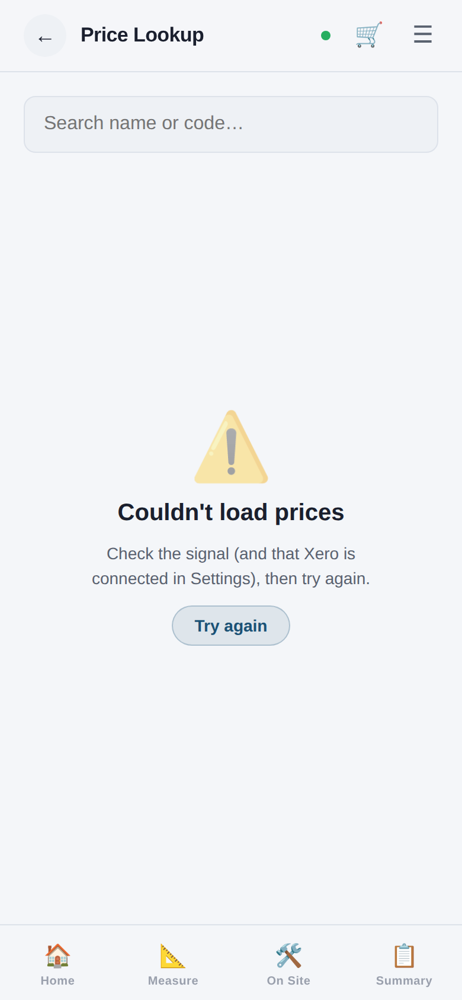

Tap the **+** on a result to add it straight to your Shopping List.

**🛒 Shopping List** is a persistent, global pick-up list — not scoped to any one job, so a shop run can buy for whatever's on:

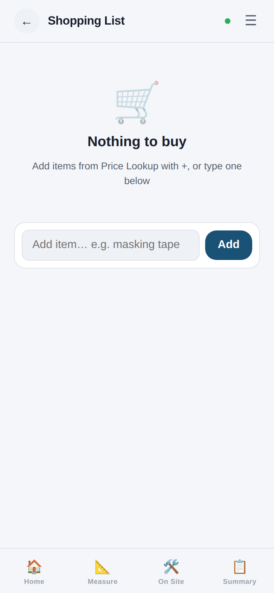

Items arrive from Price Lookup, or type one straight in ("masking tape") for anything that isn't a Xero item. Tick items off as you buy them and **Clear ticked** to reset for next time; items added from a job's materials carry that job's name as a tag, so the list says why something's on it.

---

## 9. The quote (Summary)

Open **📋 Summary** and the job becomes a priced quote:

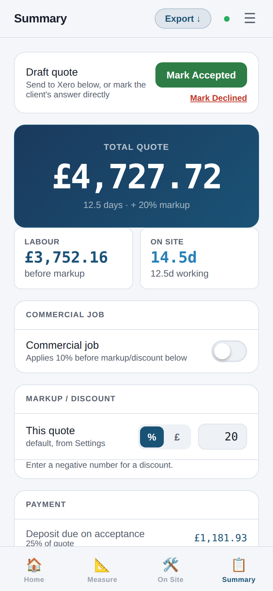

The hero card shows the **total quote**, days on site, and the markup applied. Below it:

- **Labour** (before markup) and **On Site days** at a glance.
- **Imported from Xero (pre-app quote)** — a toggle for jobs originally agreed directly in Xero before this app existed. Turn it on to honour that agreed labour figure as-is instead of the app's own room calculation; materials still come from Measure as normal. Leave it off for anything measured and priced in the app.
- **Commercial job** — a toggle that adds a percentage uplift (default 10%) before markup, for commercial rather than domestic work.
- **Standalone job** — for a job booked on its own, where 1.6 calculated days still blocks out 2 diary days: this toggle charges labour at whole diary days × your day rate (rounding up to a full or half day, per the setting in Rates). It never discounts — if the calculated labour already beats the rounded figure, nothing changes. Both figures stay visible on the quote maths, and the top-up flows through markup, deposit, Xero and the final invoice like any other labour. A job can be commercial, standalone, both or neither.
- **Markup / Discount** — this quote can override your default markup; enter a negative number for a discount.

Scroll further for the full breakdown — every room, exterior item, kitchen, fitted unit and custom line priced, labour subtotal, sundries, markup — followed by the **Materials** list: each paint totalled in litres and converted into tins to buy.

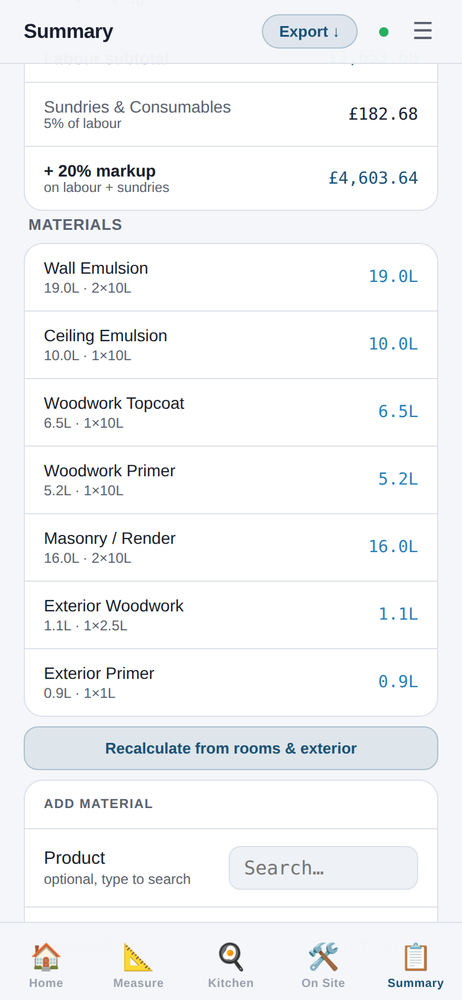

### Materials & Undo

Materials are quoted as an estimate and — once the job runs — invoiced as used, so the list on Summary and On Site is the same list throughout a job's life. **Add Material** searches your Xero items (or free-text) for anything the calculation missed, and manually-added lines carry a **Chargeable** tickbox — off keeps a line as tracking-only, on puts it on the invoice. **Recalculate** re-pulls the calculated lines from the rooms without throwing away your own additions: anything you added yourself is kept and tagged **"added by you"**, a quantity you've typed over is kept and tagged **"edited"** (with a **reset to N** link if you want the calculation's figure back), and if recalculating would drop something you edited by hand, you're asked first, by name.

Almost anything you do to the materials list — recalculating, deleting a line, changing a quantity, adding a line — can be undone. Look for an **UNDO** button on the confirmation message right after the change, **↩ Undo** at the top of the Materials list, or **↩ Undo** in the ☰ menu if you missed the moment. It remembers the last 10 changes on the current job; switching job or closing the app starts it fresh.

### Once a quote is accepted, its figures freeze

Everything in this app is calculated from your current Rates and Settings — right up until a client says yes. The moment a quote is **Accepted**, the app takes one snapshot of every figure — every room's price, the materials, the totals — and from then on the client-facing views read that frozen record, not a fresh recalculation. So nudging a coverage rate or a day rate next month can't silently move the price on a job someone already agreed to.

If the job genuinely needs to change after acceptance — a variation, a correction — Summary shows the current **Accepted quote — Revision N** and an **Amend → revision N+1** link, which re-runs the calculation once and freezes a new snapshot. The old revision stays on record; nothing is overwritten.

### Client-facing quote view

**Quote ⤴** (top bar, next to Export ↓) opens a branded, read-only one-page quote at customer-facing prices — room by room, colour schedule, payment terms and total, with your logo and business colours. It opens inside the app; tap **Save PDF** and it builds a real PDF file (as many pages as it needs) and hands it to your phone's share sheet — save it, email it straight to the client, or send it to a printer. It works with no signal, so you can produce a quote PDF standing in a house with no bars. It's regenerated live every time you open it, so it never shows stale figures, and doesn't touch Xero at all.

### Recording a deposit

Once the job is **Accepted**, the status card carries the deposit line — unless you've turned off **Deposit required** (its own toggle, default on, for jobs that don't want one: a client who always pays, work squeezed in around a bigger job).

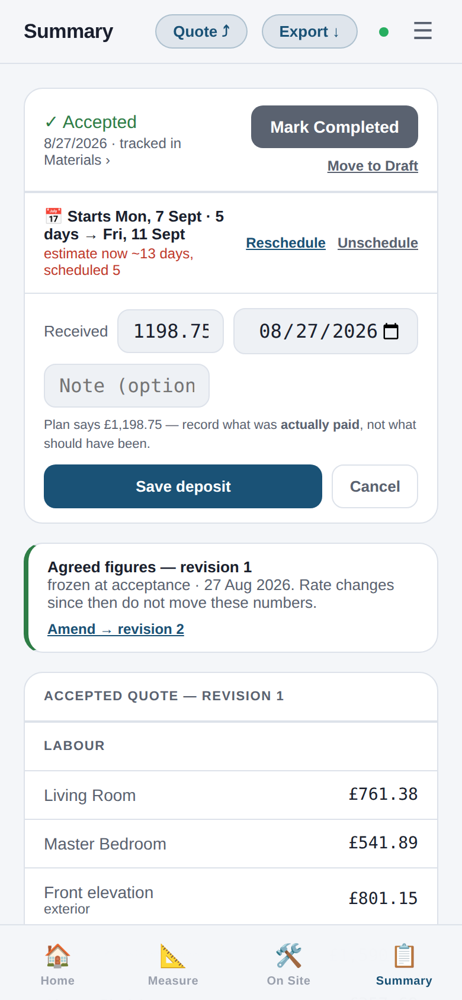

1. **Record deposit ›** — the amount is pre-filled from the quote's deposit figure; correct it to what was really paid, set the date the money arrived (matching your bank feed), add a note if you like, **Save deposit**.
2. **Sync to Xero** — creates it in Xero as Receive Money → Received as Prepayment, against the bank account chosen in Settings. **Don't also enter it in Xero yourself** — doing both double-counts the money against your bank feed.
3. **Apply it to the invoice in Xero** when you raise the invoice, exactly as before — the app can't do this step, since Xero won't let a payment be applied to a still-draft invoice.

The line then shows where things stand — *not in Xero yet*, *in Xero · unallocated*, or *in Xero · allocated ✓* — read back from Xero, which stays the boss: void or delete the deposit there and the app notices and stops saying it's synced. A failed sync loses nothing — the deposit stays recorded, the line turns red with the reason, and **Try again** is safe. Fixing a mistake (a typo, a refund) is done in Xero, not here — the app never edits or deletes a deposit that's already landed.

### Sending to Xero

Expand the **client panel** at the top of Summary:

1. **Client name** — start typing and existing Xero contacts autocomplete; picking one fills phone, email and address into blank fields only (anything you've already typed wins). **Sync to Xero** pushes the app's details the other way.
2. **Street address** autocompletes as you type; picking a suggestion fills street, town and postcode.
3. Add a **Reference** if you use them.
4. Tap **Send to Xero**. The quote is created in Xero, ready to send to the client from there, and the job's status becomes **Quoted**.

If you edit the job afterwards, the button becomes **"Update quote Q-nnn in Xero"** so re-sending updates the *same* quote — with a "Send as a NEW quote instead" option when you genuinely want a second version. Answers given in Xero flow back into the app when you next open it; an answer given in the app always wins.

### When the client answers

- **Mark Accepted** — the job moves to Accepted (synced to Xero), its figures freeze (see above), and scheduling and On Site tracking unlock.
- **Mark Declined** — the job files itself away under Declined.

Quotes that sit unanswered longer than your "chase quotes after" setting (default 14 days) pop up on Home so nothing slips.

---

## 10. Jobs

Menu (☰) → **Jobs**. The app holds any number of jobs; the one you're working on is marked **CURRENT**, and everything on Measure, Kitchen, Summary and On Site belongs to it. Tap another job to switch. Rates and Settings are global — they apply to every job.

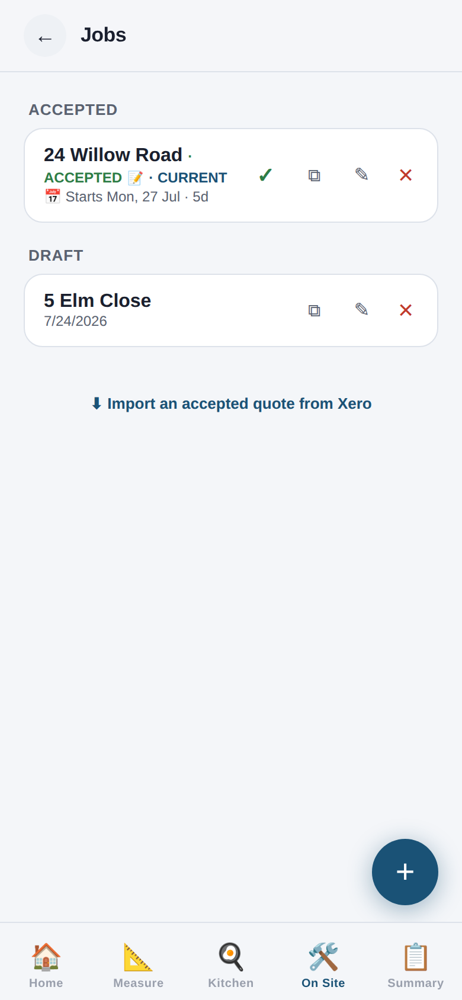

- Jobs group by status: **Draft → Quoted → Accepted / Declined → Completed → Invoiced**.
- **`+`** starts a new job. **⧉** duplicates a job as a quick template (notes aren't copied). Each job is fully separate — its own rooms, kitchen, colours and materials.
- **Import an accepted quote from Xero** — took the job on before the app existed? Import the Xero quote and it becomes a job here, with the agreed price as the record (adjustable via the **Agreed figures** card, or the **Imported from Xero** toggle on Summary — see [The quote](#9-the-quote-summary)). If a listed quote actually belongs to a job already in the app, use **"Already a job in the app? Link it ›"** instead of importing a duplicate.

---

## 11. Schedule

Menu (☰) → **Schedule** — or tap **Schedule ›** on an accepted job's Summary, which offers the next free slot automatically.

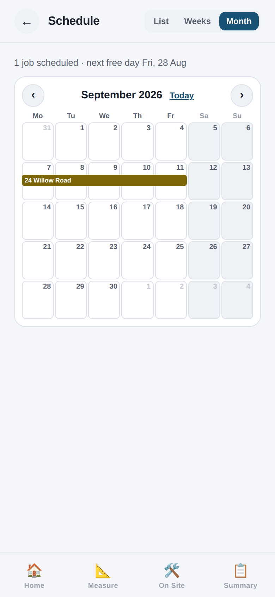

- Switch between **List**, **Weeks** and **Month** views. Jobs appear as coloured bars across their booked days; UK bank holidays are marked, and weekends are greyed out unless you've turned on **Work Saturdays** in Rates → Scheduling.
- **Tap a job's bar** → Open job, **Move start date** (then tap the new day), or Unschedule.
- **Tap an empty day** → start a job there, or **block days** for holidays and time off.
- The header tells you your **next free day** at all times.

**A one-off day out of the ordinary**, without changing anything globally: tap the day itself → **start a job here** (or move a job there), and the confirm tells you what switches on — a Saturday turns on "Saturdays for this job only", a Sunday or bank holiday turns on "Every day for this job only". From an accepted job's own **Schedule ›** form, the same idea is the **Days worked** picker (Usual / + Saturdays / Every day), which switches itself if you pick such a start date. Automatic slot suggestions still only ever offer your usual working days, and your own blocked days always win.

**See jobs in your phone calendar:** Rates → Scheduling → turn on **Calendar feed**, then tap the link to copy it and subscribe in your calendar app. Booked jobs then appear alongside everything else in your life.

---

## 12. On Site — running the job

Once a job is accepted, the **🛠 On Site** tab is your day-to-day companion:

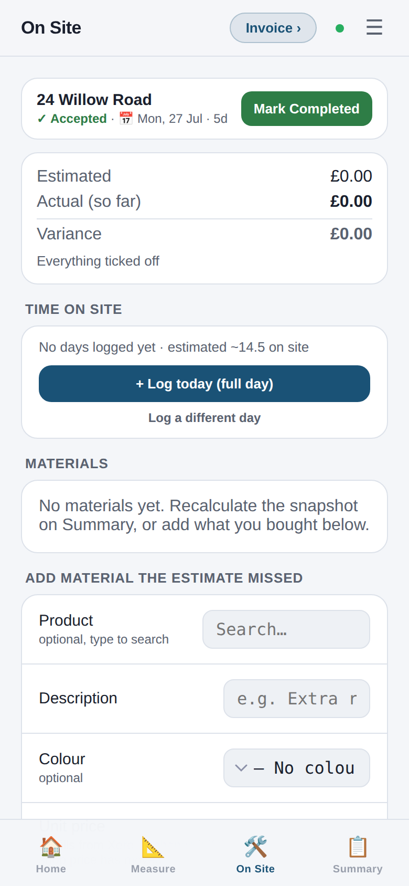

- **Estimated vs Actual** — the card at the top tracks what the materials are really costing against what you quoted, with the variance.
- **Time on Site** — tap **+ Log today (full day)** at the end of each day (or *Log a different day* to back-fill). This builds the true labour record for the job.
- **Materials** — the quote's materials list becomes a shopping list. Tick items off as you buy them, and correct quantities/prices to what you actually paid — see [Materials & Undo](#materials--undo) for how edits and Recalculate interact, and Undo if something goes wrong.
- **Add material the estimate missed** — extra sundries or a forgotten tin: search the product, set the price, done.
- **Variations** — the client asks for "just one more room" mid-job? Add the room (or exterior item, fitted unit) on Measure and flick its **Variation** toggle. It's priced with the same engine but kept separate from the accepted quote, and appears in its own Variations card here. Each variation carries a status — tap **✓ Approved by client** to record their yes (with an optional note; the date is stamped automatically), or mark one Declined to drop it from the totals and the final invoice while keeping the record. Anything still Pending gets called out before the final invoice will let it through.
- **Invoice ›** (top right) shows the materials list formatted for invoicing, with a **Copy** button.

### Let the client approve extras themselves

Under the Variations card, **Send for approval** creates a private web page for this job and puts the link on your clipboard — text it, WhatsApp it, or email it to the client.

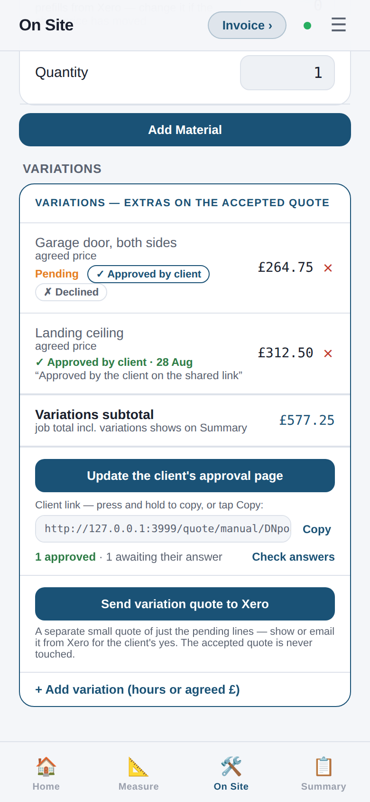

They open it on their phone. No login, no app to install:

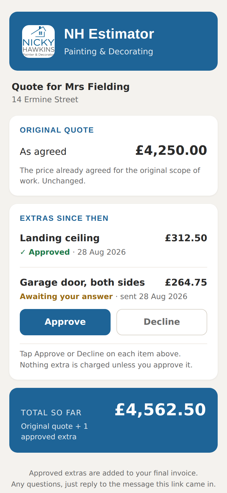

The page shows **the original quote as a single total** (never the itemised breakdown — they've already had that document), then every extra since, with **Approve** and **Decline** buttons on the ones still waiting. The total at the bottom is the original quote plus the extras they've said yes to — pending ones aren't in it, so the figure is never a bill for work they haven't agreed to.

A few things worth knowing:

- **Their answer comes back to you.** Tap **Check answers** on the card, or just reopen the job — the app pulls their taps in and sets the line's status for you, with a note saying it came from the link. If *you* already recorded an answer by hand, yours stands: the person who was there wins.
- **Nothing goes to Xero.** This is entirely separate from **Send variation quote to Xero** below it. Approved extras still reach Xero the usual way — as lines on the final invoice.
- **Prices are frozen once they answer.** Re-measure a room after the client approved that extra and the page keeps the figure they agreed to. Tapping **Send for approval** again updates the same page — it never creates a second link — and refreshes the prices only on the extras still awaiting an answer.
- **Withdrawing an extra.** Remove or unflag a variation and it disappears from their page next time you send — unless they'd already answered it, in which case it stays as the record.
- **The link is the password.** Anyone with it can see this job's totals and answer its extras, so treat it like the quote itself. It's specific to one job and doesn't expire.
- **What the client can reach.** The link only opens that one job's page. But it's the same web address the app runs on, so if someone trims the link back to the domain they land on the app's front door — which is why the app password (`APP_PASSWORD`) matters: with it set they get a login screen and nothing else. A custom domain makes the link read as your business rather than as a hosting provider, but it doesn't change what's behind the front door — the password does.

When the work's done, tap **Mark Completed** — the job moves on, and Home reminds you it needs invoicing until you do.

---

## 13. The final invoice

On a **Completed** job, On Site shows **Build final invoice**. The builder assembles the whole money story in one list:

- labour **as quoted** (the frozen accepted figure, not the hours it took),
- plus **approved variations** (including the ones the client approved on their own link),
- plus the **actual materials** used (from your ticked-off list),
- minus any **deposit already recorded and synced to Xero**.

Review the lines, adjust anything, then send — the app writes **one draft invoice into Xero** and marks the job **Invoiced**. You approve and send the invoice from Xero as usual, so nothing goes to the client without your say-so. Applying the recorded deposit to this invoice, once it exists in Xero, is still done in Xero.

Once a job is Invoiced, Summary shows a read-only **Job Profitability** card telling three separate stories: **Billing** (quoted vs invoiced, with a note if they differ), **Schedule** (days quoted vs days actually logged), and **Materials** (quoted materials vs the real trade cost of what was used, with your markup on materials banked as its own figure). It's reference only — nothing here feeds back into pricing.

---

## 14. Rates

Menu (☰) → **Rates** — every number the calculator uses, grouped by what it prices. A change here applies to every future calculation, and reprices any open (un-accepted) draft immediately — accepted quotes are unaffected, since [their figures are already frozen](#once-a-quote-is-accepted-its-figures-freeze).

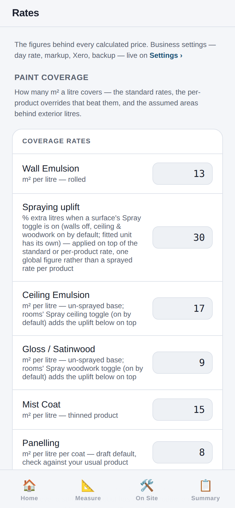

| Section | Card | What's in it |
|---|---|---|
| Paint Coverage | **Coverage Rates** | Standard m²/litre per surface, the spraying uplift %, and per-product rates that beat the standard figure for a specific paint range |
| Paint Coverage | **Exterior Paint Coverage & Areas** | Assumed areas and coverages behind exterior litres |
| Labour Times | **Time Rates** | Minutes per m² (or per item) for every surface, doors/frames, sills, mist, panelling, staircase parts |
| Labour Times | **Exterior Rates** | Minutes per coat for masonry, fascias, windows, doors, garage, sash extras, access uplifts |
| Item & Job-Type | **Doors & Frames** | Paintable areas per face, fire-door surcharge, ironmongery prices |
| Item & Job-Type | **Wallpaper Rates** | Per-roll rates, ceiling/staircase multipliers, minimum price, wide vinyl & mural rates |
| Item & Job-Type | **Kitchen Rates** | The full price matrix per item type × size, linear rates, carcass %, strip-original-coating minutes |
| Item & Job-Type | **Fitted Unit / Shelving** | Shelf and bay spray times, fallback areas behind fitted-unit litres |
| Scheduling | **Scheduling** | Daily overhead, schedule buffer, Work Saturdays, bank-holiday region, calendar feed |

> **Calibrate as you go:** after a few jobs, compare the logged time and actual materials on On Site with what was estimated, and nudge the time and coverage rates here. The estimates get sharper with every job.

---

## 15. Settings

Menu (☰) → **Settings**. Everything that isn't a calculation rate lives here: your business identity, pricing defaults, Xero, and backup.

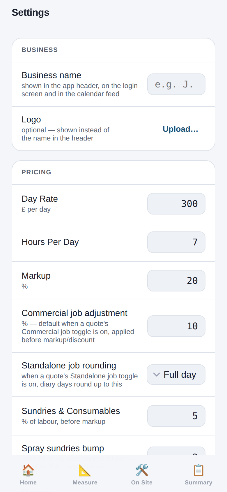

| Section | What's in it |
|---|---|
| **Business** | Your business name and logo — shown in the app header, on the sign-in screen, at the top of every quote you send and its PDF, and in the calendar feed |
| **Pricing** | Day rate, hours per day, markup %, sundries %, spray sundries bump, deposit %, commercial job adjustment, standalone-job rounding (full or half days), and how many days before an unanswered quote gets flagged |
| **Deposits (Xero)** | The bank account a recorded deposit lands in, and the account code it posts to |
| **Xero Integration** | Connect / disconnect |
| **Materials (Xero Items)** | Refresh your product list from Xero and set the default product for each role |
| **Quote & Invoice Text** | The per-job-type wording templates for quotes and final invoices |
| **Calibration** | What your finished jobs say about two of your settings — see below |
| **Appearance** | Light / Dark / Auto theme (this device only) |
| **Backup** | Export and import everything — see below |

### Calibration — let finished jobs correct your settings

Some of the figures behind your prices started life as sensible guesses. This card
compares them against what actually happened on your last few finished jobs.

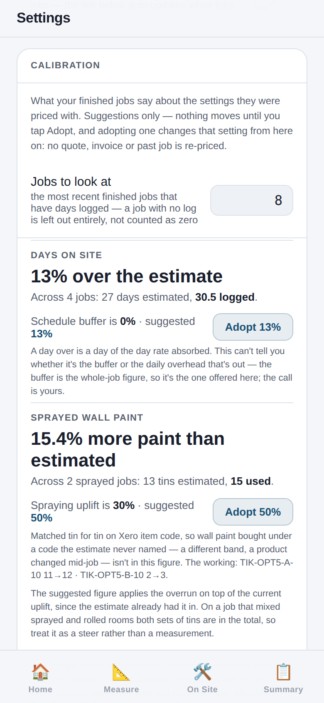

**Days on site** adds up the days you logged on *On Site → Time on site* and compares
them with the days those jobs were quoted for. If you're consistently running over, the
percentage is the **Schedule buffer** you should probably be padding quotes with.

**Sprayed wall paint** does the same for tins: on jobs where at least one room had
**Spray walls** on, it compares the wall paint the estimate asked for against what you
logged as used, and turns the difference into a **Spraying uplift** figure.

Three things worth knowing:

- **Jobs with nothing logged are left out completely** — not counted as zero. A job you
  never logged days for says nothing about how long jobs take, so it isn't allowed to.
  The card tells you when it has left jobs out, and why.
- **Nothing changes until you tap Adopt.** Adopting sets that one setting for quotes from
  now on. No quote, invoice or finished job is re-priced — accepted quotes are frozen
  anyway.
- **Change "Jobs to look at"** to widen or narrow the sample. Eight is a reasonable
  default; drop it to 3 if you've recently changed how you work.

If a suggestion says *"not enough data yet"*, it's telling you what's missing — usually
that no sprayed job in the sample has its materials logged. It'll appear on its own once
the data does.

The sundries % and the exterior assumed areas aren't offered here, and that's deliberate:
nothing in the app tracks what you actually spend on sundries, and an exterior paint
overrun could be the assumed area or the coverage rate — there's no way to tell which.
Those stay your judgement call.

---

## 16. Backups

Settings → **Backup**:

- **Export everything** downloads a single JSON file containing every job, room, setting and colour. Do this regularly — Home will nag you when the last backup is getting old.
- **Import backup** restores from a file, adding to what's already there — imported jobs get fresh identities, so it can never overwrite existing data. Restoring settings is a separate opt-in on the import preview, since it's the one thing an import *can* overwrite.

---

## 17. Tips & troubleshooting

**The dot** in the top bar is your sync status: green = everything saved to the server, amber = saving now, red = offline. If you lose signal mid-measure, keep working — changes are kept on your phone ("Offline — N changes queued on this phone") and pushed up when the connection returns; the menu's sync line confirms with "All changes synced ✓".

**A price looks wrong?** Work backwards: room Preview → Summary breakdown → Rates. The calculation is always *areas × time rates × day rate*, plus *areas ÷ coverage = litres → tins*, plus sundries and markup. One of those numbers will be the culprit — usually a coverage or time rate that doesn't match how you actually work. If the job is already **Accepted**, remember its figures are frozen — a rate change won't move it; you'd need **Amend → revision N+1** on Summary.

**Xero button not working?** Tokens occasionally expire for good if the app hasn't talked to Xero in a long while. Settings → Disconnect Xero → Connect Xero puts it right in under a minute.

**Sent a quote, then client wants changes?** Just edit the rooms and hit **Update quote Q-nnn in Xero** on Summary — same quote number, new figures.

**Extra work mid-job?** Always add it as a **Variation** rather than editing the accepted rooms — the original quote stays honest, and the extra shows separately on the final invoice where the client expects to see it.

**Recording a deposit but the option's greyed out?** A linked Xero contact is required before you can sync to Xero — the app will point you at Sync to Xero on the client details. You can still record the deposit locally in the meantime.

**The build number** at the bottom of the ☰ menu is how you check a new version has actually reached your phone after a deploy.

---

*Manual for NH Estimator v2.40.0. Screenshots taken from the app with example data.*

*Keeping this manual up to date: edit this file, then run `npm run build:manual` to regenerate the PDF edition ([NH-Estimator-User-Manual.pdf](NH-Estimator-User-Manual.pdf)) and commit both together. The cover picks up the app version and date automatically.*
