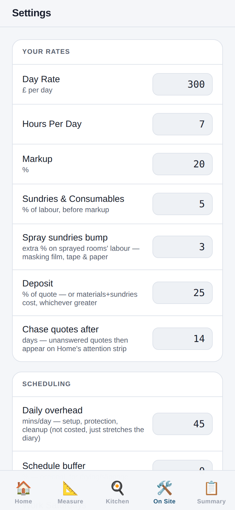

# NH Estimator — User Manual

*A pocket guide to the Nicky Hawkins paint-estimating app, from first measure to final invoice.*

NH Estimator is a phone-first web app for pricing decorating work. You walk round the property measuring up, and the app turns those measurements into a fully priced quote — labour, materials, markup, deposit and payment plan — which you can send straight into Xero. Once a quote is accepted, the same app schedules the job, tracks the materials and time you actually use on site, and builds the final invoice back into Xero when you're done.

This manual follows the life of a job in order: **set up → measure → quote → schedule → on site → invoice**. If you're brand new, read [Getting started](#1-getting-started) and [Measuring up](#3-measuring-up) first — the rest will make sense as you need it.

---

## Contents

1. [Getting started](#1-getting-started)
2. [Finding your way around](#2-finding-your-way-around)
3. [Measuring up](#3-measuring-up)
4. [Kitchen cabinet respray](#4-kitchen-cabinet-respray)
5. [The quote (Summary)](#5-the-quote-summary)
6. [Jobs](#6-jobs)
7. [Schedule](#7-schedule)
8. [On Site — running the job](#8-on-site--running-the-job)
9. [The final invoice](#9-the-final-invoice)
10. [Colours](#10-colours)
11. [Settings](#11-settings)
12. [Backups](#12-backups)
13. [Tips & troubleshooting](#13-tips--troubleshooting)

---

## 1. Getting started

### Install it on your phone

The app lives at your own web address (the one on your Render account). It's designed to be **installed to your home screen** so it opens full-screen like a normal app:

- **iPhone:** open the app in Safari → tap the Share button → **Add to Home Screen**.
- **Android:** open it in Chrome → menu (⋮) → **Add to Home screen** / **Install app**.

There's no login — the app is yours alone, so guard the web address like you would any private page.

### Connect Xero (one-off)

Almost everything works without Xero, but quoting and invoicing shine with it connected:

1. Open the menu (☰) → **Settings**.
2. Scroll to **Xero Integration** → tap **Connect Xero** and sign in.
3. Back in Settings, under **Materials (Xero Items)**, tap **Refresh from Xero** to pull in your paint products, then pick your default products (wall paint, ceiling, woodwork, primer, mist coat, masonry…). Every new room starts with these defaults, so set them once and forget them.

### Check your rates

Settings is pre-loaded with sensible defaults (day rate £300, 20% markup, 25% deposit, standard coverage rates). Skim through [Settings](#11-settings) once and adjust anything that doesn't match how you price — every figure in a quote comes from these numbers.

---

## 2. Finding your way around

The **Home** screen is your morning glance: the current job and its status, a **Materials to buy** count, what's **next on site**, and shortcut links. When something needs chasing — a quote that's gone unanswered too long, a finished job you haven't invoiced — it appears at the top of Home as an attention strip.

The **bottom bar** is always visible and follows the life of a job, left to right:

| Tab | What it's for |
|---|---|
| 🏠 **Home** | Dashboard and reminders |
| 📐 **Measure** | Rooms and exterior items for the current job |
| 🍳 **Kitchen** | Cabinet-spray calculator |
| 🛠 **On Site** | Time, materials and variations while the job runs |
| 📋 **Summary** | The priced quote, Xero, and job status |

The **menu (☰)**, top right on most screens, holds the job-admin screens: **Jobs**, **Colours**, **Schedule** and **Settings**, plus a sync line — "All changes synced ✓" means everything you've entered is safely on the server. Everything saves automatically as you type; there is no save button to forget.

---

## 3. Measuring up

Open **📐 Measure**. This screen lists everything measured for the current job, split into **Interior** (rooms) and **Exterior** items, each showing its price and estimated days at a glance. The chip at the top keeps a running total for the whole job.

Tap the **`+` button** (bottom right) and choose what you're adding:

> **Quick add:** walking a big house? Tap **Quick add** instead and just type the room names one after another — Living Room, Hall, Bedroom 1… — then go back round measuring each one on a second pass. Much faster than filling in a full form in every doorway.

### Adding a room

The form works top to bottom, and only the top matters for a basic room:

1. **Room Name** — e.g. "Living Room".
2. **Dimensions** — length, width and height in metres (height starts at 2.4 m). The app works out wall and ceiling areas itself.
3. **Coats** — walls, ceiling and woodwork each default to 2. Set any of them to 0 to skip that surface entirely (e.g. ceiling not being painted).

Then the optional sections, which you'll use as the room demands:

- **Staircase / HSL** — flick this toggle for a hall/stairs/landing and the form swaps in staircase geometry: floors, steps, stair width, spindles, newel posts. The app calculates the awkward angled wall areas for you.
- **Excluded Walls** — walls you're *not* painting (a tiled wall, wallpaper that's staying). Add its width × height and it's deducted.
- **Extras** — windows (m²), window sills, doors and radiators. Each adds its own time and paint.
- **Preparation** — Minimal / Standard / Heavy, or a custom percentage. This scales labour. **Making Good** adds a fixed £ amount for repairs.
- **Mist Coat** — for fresh plaster; tick walls and/or ceiling.
- **Spray Application** — price the walls for spraying rather than brush and roller.
- **Paint & Colour** — each surface takes your default product from Settings; override the product, colour band or colour here when a room is different.
- **Feature Wall** — one wall in a different finish: paint, or wallpaper (standard, wide vinyl or mural).
- **Wallpaper** — lining and finish paper for walls or ceiling, with roll size and pattern-repeat inputs. The app works out **rolls to order**, including the spare-roll option.
- **Panelling** — wall panelling by area with its own coats, prep and colour.

A **Preview** card at the bottom shows the wall/ceiling areas and this room's estimated cost and time as you type, so you can sanity-check before you leave the room. Tap **Save** (top right) when you're happy. To change a room later, tap it in the Measure list; **Delete Room** is at the bottom of the edit form.

### Adding an exterior item

Exterior work is priced per *item* — typically one per elevation ("Front elevation", "Rear + gable") or per job type ("Fascias all round"). Each item is a menu of exterior work; fill in only what applies:

- **Masonry / Render** — area in m² and coats, with toggles for **textured render** (more paint, more time) and **spray render**.
- **Fascias & Soffits** — linear metres and coats.
- **Exterior Windows / Doors / Garage doors** — counts and coats; windows can be added individually with size and access.
- **Porch / Feature Door** — priced in days.
- **Sash Window Restoration** — added per window.
- **Preparation** and **Making Good** — same idea as rooms.
- **Paint Colours** — masonry and woodwork colours for the quote.

The **Preview** at the bottom shows cost and time; **Save** adds it to the Measure list.

### Site notes

Tap the **📝 button** (bottom left of Measure) any time to jot job notes — access arrangements, things agreed on the doorstep, snags you spotted. Notes save automatically and stay with the job.

---

## 4. Kitchen cabinet respray

The **🍳 Kitchen** tab is a dedicated calculator for cabinet spraying — one kitchen per job, saved automatically.

- **Coat count** (1–4) applies to every item below.
- Tap open **Doors, Drawer Fronts, End Panels** and **Fillers** and enter how many of each size (Small / Medium / Large / X-Large). Each size has its own base price and per-coat price — tune them in Settings → Kitchen Rates.
- **Linear items** — cornices and plinths are priced per metre.
- **Carcass spraying** — toggle on to add a percentage uplift for spraying the cabinet interiors/carcasses.
- **Colour & Product** — pick the paint for the quote and materials list.

The chip at the top shows the kitchen's running total, and the whole kitchen appears as its own line in the quote.

---

## 5. The quote (Summary)

Open **📋 Summary** and the job becomes a priced quote:

The hero card shows the **total quote**, days on site, and the markup applied. Below it:

- **Labour** and **On Site days** at a glance.
- **Markup / Discount** — this quote can override your default markup; enter a negative number for a discount.
- **Payment** — the **deposit** due on acceptance (your default % from Settings) and the **balance**. Switch the payment plan to **Multi-week** to show weekly instalments across the job.

Scroll further for the full breakdown — every room and exterior item priced, labour subtotal, sundries, markup — followed by the **Materials** list: each paint totalled in litres and converted into tins to buy.

If you change rooms after quoting, tap **Recalculate from rooms & exterior** to refresh the materials snapshot. The **Export ↓** button (top right) exports the quote as a CSV file.

### Sending the quote to Xero

Expand the **Xero panel** at the top of Summary:

1. **Client name** — start typing and existing Xero contacts autocomplete; picking one pulls in their details. Or type a new name and fill in phone, email and address (address autocompletes if Google Places is set up).
2. Add a **Reference** if you use them.
3. Tap **Send to Xero**. The quote is created in Xero, ready to send to the client from there.

If you edit the job afterwards, the button becomes **"Update quote Q-nnn in Xero"** so re-sending updates the *same* quote — with a "Send as a NEW quote instead" option when you genuinely want a second version.

### When the client answers

At the top of Summary:

- **Mark Accepted** — the job moves to Accepted (synced to Xero), and scheduling and On Site tracking unlock.
- **Mark Declined** — the job files itself away under Declined.

Quotes that sit unanswered longer than your "chase quotes after" setting (default 14 days) pop up on Home so nothing slips.

---

## 6. Jobs

Menu (☰) → **Jobs**. The app holds any number of jobs; the one you're working on is marked **CURRENT**, and everything on Measure, Kitchen, Summary and On Site belongs to it. Tap another job to switch.

- Jobs group by status: **Accepted**, **Quoted**, **Draft**, with finished work (Completed / Invoiced / Declined) dimmed below.
- **`+`** starts a new job. Each job is fully separate — its own rooms, kitchen, colours and materials.
- Row shortcuts: **✓** mark completed, duplicate, rename, and **✕** delete.
- **Import an accepted quote from Xero** — took the job on before the app existed? Import the Xero quote and it becomes a job here, with the agreed price as the record.

---

## 7. Schedule

Menu (☰) → **Schedule** — or tap **Schedule ›** on an accepted job's Summary, which offers the next free slot automatically.

- Switch between **List**, **Weeks** and **Month** views. Jobs appear as coloured bars across their booked days; UK bank holidays are marked, and weekends are greyed out unless you've turned on **Work Saturdays** in Settings.
- **Tap a job's bar** → Open job, **Move start date** (then tap the new day), or Unschedule.
- **Tap an empty day** → start a job there, or **block days** for holidays and time off.
- The header tells you your **next free day** at all times.

**See jobs in your phone calendar:** Settings → Scheduling → turn on **Calendar feed**, then tap the link to copy it and subscribe in your calendar app. Booked jobs then appear alongside everything else in your life.

---

## 8. On Site — running the job

Once a job is accepted, the **🛠 On Site** tab is your day-to-day companion:

- **Estimated vs Actual** — the card at the top tracks what the materials are really costing against what you quoted, with the variance.
- **Time on Site** — tap **+ Log today (full day)** at the end of each day (or *Log a different day* to back-fill). This builds the true labour record for the job.
- **Materials** — the quote's materials list becomes a shopping list. Tick items off as you buy them, and correct quantities/prices to what you actually paid. The badge on the On Site tab shows how many items are still to buy.
- **Add material the estimate missed** — extra sundries or a forgotten tin: search the product, set the price, done. It's tracked for the final invoice.
- **Variations** — the client asks for "just one more room" mid-job? Add the room (or exterior item) on Measure and flick its **Variation** toggle. It's priced with the same engine but kept separate from the accepted quote, and appears in its own Variations card here and on the invoice.
- **Invoice ›** (top right) shows the materials list formatted for invoicing, with a **Copy** button.

When the work's done, tap **Mark Completed** — the job moves on, and Home reminds you it needs invoicing until you do.

---

## 9. The final invoice

On a **Completed** job, On Site shows **Build final invoice**. The builder assembles the whole money story in one list:

- labour **as quoted** (the price you agreed, not the hours it took),
- plus **variations**,
- plus the **actual materials** used (from your ticked-off list),
- minus the **deposit** and any other deductions.

Review the lines, adjust anything, then send — the app writes **one draft invoice into Xero** and marks the job **Invoiced**. You approve and send the invoice from Xero as usual, so nothing goes to the client without your say-so.

---

## 10. Colours

Menu (☰) → **Colours** — the job's colour schedule. As you and the client settle on colours, note each one here: a label for where it goes, plus brand and colour name from the built-in library of common UK trade colours (Farrow & Ball, Dulux, Little Greene and more).

Numbered colour slots are what the room forms' colour chips point at — so "wall colour 1" in a room always means colour 1 on this list. Decide the colours once, and every surface that uses them updates.

---

## 11. Settings

Menu (☰) → **Settings**. Every number the calculator uses lives here, so a change applies to all future pricing. Everything saves as you type.

| Section | What's in it |
|---|---|
| **Your Rates** | Day rate, hours per day, markup %, sundries %, spray sundries bump, deposit %, and how many days before an unanswered quote gets flagged |
| **Scheduling** | Daily overhead minutes, schedule buffer, Work Saturdays, bank-holiday region, and the calendar feed |
| **Coverage Rates** | m² per litre for each paint type — the heart of the materials maths |
| **Time Rates** | Minutes per m² / per item for walls, ceilings, woodwork, doors, windows, radiators… the heart of the labour maths |
| **Wallpaper Rates** | Per-roll pricing, ceiling and staircase multipliers, minimum charge |
| **Exterior Rates** | Rates and coverage for masonry, fascias, exterior windows and doors |
| **Kitchen Rates** | The size-by-size price table for doors, drawers, panels, cornices, plinths, carcass % |
| **Xero Integration** | Connect / Disconnect Xero |
| **Materials (Xero Items)** | Refresh your product list from Xero and set the default product for each role |
| **Appearance** | Light / Dark / Auto theme |
| **Backup** | Export and import everything — see below |

> **Calibrate as you go:** after a few jobs, compare the logged time and actual materials on On Site with what was estimated, and nudge the time and coverage rates here. The estimates get sharper with every job.

---

## 12. Backups

Settings → **Backup**:

- **Export everything** downloads a single JSON file containing every job, room, setting and colour. Do this regularly — Home will nag you when the last backup is getting old.
- **Import backup** restores from a file, adding to what's already there.

The **Clear Everything** button in Settings does exactly what it says across all jobs — it's for starting completely fresh, not for deleting one job (do that from the Jobs screen). Export a backup first.

---

## 13. Tips & troubleshooting

**The dot** in the top bar is your sync status: green = everything saved to the server, amber = saving now, red = offline. If you lose signal mid-measure, keep working — changes are kept on your phone ("Offline — changes saved on this phone") and pushed up when the connection returns; the menu's sync line confirms with "All changes synced ✓".

**A price looks wrong?** Work backwards: room Preview → Summary breakdown → Settings rates. The calculation is always *areas × time rates × day rate*, plus *areas ÷ coverage = litres → tins*, plus sundries and markup. One of those numbers will be the culprit — usually a coverage or time rate that doesn't match how you actually work.

**Xero button not working?** Tokens occasionally expire for good if the app hasn't talked to Xero in a long while. Settings → Disconnect Xero → Connect Xero puts it right in under a minute.

**Sent a quote, then client wants changes?** Just edit the rooms and hit **Update quote Q-nnn in Xero** on Summary — same quote number, new figures.

**Materials list out of date after edits?** Tap **Recalculate from rooms & exterior** on Summary. (The app deliberately doesn't do this behind your back once you've started ticking things off on site.)

**Extra work mid-job?** Always add it as a **Variation** rather than editing the accepted rooms — the original quote stays honest, and the extra shows separately on the final invoice where the client expects to see it.

---

*Manual for NH Estimator v2.0.0. Screenshots taken from the app with example data.*
